SEER Sigmoidoscopy Project
================
<david.hein@utsouthwestern.edu>
2023-04-03

- <a href="#1-load-packages-and-raw-data"
  id="toc-1-load-packages-and-raw-data">1 Load packages and raw data</a>
- <a href="#2-data-cleaning" id="toc-2-data-cleaning">2 Data cleaning</a>
- <a href="#3-setting-reference-groups"
  id="toc-3-setting-reference-groups">3 Setting reference groups</a>
- <a href="#4-bar-graph-figure" id="toc-4-bar-graph-figure">4 Bar graph
  figure</a>
- <a href="#5-logistic-regression" id="toc-5-logistic-regression">5
  Logistic Regression</a>
  - <a href="#51-logistic-results-sex" id="toc-51-logistic-results-sex">5.1
    Logistic results: sex</a>
  - <a href="#52-logistic-results-age" id="toc-52-logistic-results-age">5.2
    Logistic results: age</a>
  - <a href="#53-logistic-results-stage"
    id="toc-53-logistic-results-stage">5.3 Logistic results: stage</a>
  - <a href="#54-logistic-results-year"
    id="toc-54-logistic-results-year">5.4 Logistic results: year</a>
  - <a href="#55-logistic-results-race"
    id="toc-55-logistic-results-race">5.5 Logistic results: race</a>
  - <a href="#56-logistic-results-multivariate"
    id="toc-56-logistic-results-multivariate">5.6 Logistic results:
    multivariate</a>
- <a href="#6-survival-exploration-wcss"
  id="toc-6-survival-exploration-wcss">6 Survival exploration w/CSS</a>
  - <a href="#61-km-plots-can-see-on-sigmoidoscopy"
    id="toc-61-km-plots-can-see-on-sigmoidoscopy">6.1 KM plots: Can see on
    sigmoidoscopy</a>
  - <a href="#62-km-plots-stage" id="toc-62-km-plots-stage">6.2 KM plots:
    Stage</a>
  - <a href="#63-km-plots-year-of-diag"
    id="toc-63-km-plots-year-of-diag">6.3 KM plots: year of diag</a>
  - <a href="#64-km-plots-sex" id="toc-64-km-plots-sex">6.4 KM plots:
    sex</a>
  - <a href="#65-km-plots-age-group" id="toc-65-km-plots-age-group">6.5 KM
    plots: age group</a>
  - <a href="#66-km-plots-raceeth" id="toc-66-km-plots-raceeth">6.6 KM
    plots: race/eth</a>
  - <a href="#67-km-plots-site" id="toc-67-km-plots-site">6.7 KM plots:
    Site</a>
- <a href="#7-survival-analysis" id="toc-7-survival-analysis">7 Survival
  Analysis</a>
  - <a href="#71-css" id="toc-71-css">7.1 CSS</a>
    - <a href="#711-local" id="toc-711-local">7.1.1 Local</a>
    - <a href="#712-regional" id="toc-712-regional">7.1.2 Regional</a>
    - <a href="#713-distant" id="toc-713-distant">7.1.3 Distant</a>
  - <a href="#72-os" id="toc-72-os">7.2 OS</a>
    - <a href="#721-local" id="toc-721-local">7.2.1 Local</a>
    - <a href="#722-regional" id="toc-722-regional">7.2.2 Regional</a>
    - <a href="#723-distant" id="toc-723-distant">7.2.3 Distant</a>
- <a href="#8-km-plots-with-better-95-cis"
  id="toc-8-km-plots-with-better-95-cis">8 KM Plots with better 95%
  CIs</a>
  - <a href="#81-css-plots" id="toc-81-css-plots">8.1 CSS Plots</a>
  - <a href="#82-os-plots" id="toc-82-os-plots">8.2 OS plots</a>
- <a href="#9-session-info" id="toc-9-session-info">9 Session Info</a>

<br>

# 1 Load packages and raw data

``` r
library(broom)
library(MASS)
library(survival)
library(survminer)
library(tidyverse)
library(survRM2)
library(km.ci)
library(readr)
library(table1)
library(extrafont)
set.seed(2023)

seer_data <- read_delim("seer_data.txt", delim = "\t", escape_double = FALSE, trim_ws = TRUE)
```

<br>

# 2 Data cleaning

``` r
# Get only variables we want
new_data<-seer_data%>%dplyr::select(Sex, `Year of diagnosis`,
                                `Race and origin recode (NHW, NHB, NHAIAN, NHAPI, Hispanic)`,
                                `Primary Site`,`Grade (thru 2017)`,
                                `Grade Pathological (2018+)`,
                                `Combined Summary Stage (2004+)`,
                                `Summary stage 2000 (1998-2017)`,
                                `SEER cause-specific death classification`,
                                `Survival months`,
                                `Age recode with single ages and 100+`,
                                `Survival months flag`,
                                `Vital status recode (study cutoff used)`,
                                `Grade Clinical (2018+)`,
                                `Histologic Type ICD-O-3`)

# need to take out 181 appendix, 260, 188, and 189 becuase location unknown
new_data <-new_data %>% filter( !`Primary Site` %in% c(260,188,189,181))

# only adenocarcinoma
new_data <- new_data %>%filter(`Histologic Type ICD-O-3`==8140)

# make a new variable for site being seen on colonsocopy or sigmoid, should include 186 descending, 187 sigmoid, 199 rectosigmoid junction, 209 rectum NOS
new_data <- new_data %>% mutate(can_see_sigmoid = ifelse( `Primary Site` %in% c(186,187,199,209),1,0))

# make new variable for 3 age groups
new_data <- new_data %>% mutate(age_numeric = as.numeric(str_extract(`Age recode with single ages and 100+`,"[:digit:]+")))
new_data <- new_data %>% mutate(age_group_final = ifelse(age_numeric <45,'under45', 'over50'))%>%
  mutate(age_group_final = ifelse(age_numeric <50 & age_numeric >= 45,'45-50',age_group_final))

# Combine the two stages
new_data<-new_data%>%mutate(new_stage = ifelse(`Summary stage 2000 (1998-2017)`=="Blank(s)",
                                               `Combined Summary Stage (2004+)`,`Summary stage 2000 (1998-2017)`))

# Filter out unknown stage an in situ
new_data2 <-new_data %>% filter( !new_stage %in%c("Unknown/unstaged","In situ"))

# Make nice grade variable
new_data2 <- new_data2 %>% mutate(final_grade = `Grade Pathological (2018+)`)
new_data2 <- new_data2 %>% mutate(final_grade = ifelse(`Grade (thru 2017)` %in% "Poorly differentiated; Grade III", "3", final_grade))
new_data2 <- new_data2 %>% mutate(final_grade = ifelse(`Grade (thru 2017)` %in% "Undifferentiated; anaplastic; Grade IV", "4", final_grade))
new_data2 <- new_data2 %>% mutate(final_grade = ifelse(`Grade (thru 2017)` %in% "Moderately differentiated; Grade II", "2", final_grade))
new_data2 <- new_data2 %>% mutate(final_grade = ifelse(`Grade (thru 2017)` %in% "Well differentiated; Grade I", "1", final_grade))

# toss em in an unknown/other
new_data2 <- new_data2 %>% mutate(final_grade = ifelse(final_grade%in%c("A", "B", "Blank(s)", "L","C", "H", "9","D"),"unk_other",final_grade))

# make smaller year of diagnosis groups
new_data2 <- new_data2 %>% mutate(year_of_diag = case_when(`Year of diagnosis`%in%c('2000', '2001', '2002' ,'2003' ,'2004') ~ "yod1",
                                                            `Year of diagnosis`%in%c('2005','2006', '2007', '2008' ,'2009') ~ "yod2",
                                                            `Year of diagnosis`%in%c('2010', '2011', '2012' ,'2013' ,'2014') ~ "yod3",
                                                            `Year of diagnosis`%in%c('2015', '2016', '2017' ,'2018' ,'2019') ~ "yod4"))

# make cleaner race/eth column name
new_data2<- new_data2%>%rename(race_eth=`Race and origin recode (NHW, NHB, NHAIAN, NHAPI, Hispanic)`)

# Survival
new_data3<-new_data2%>% mutate(cancer_specific_status = ifelse(`SEER cause-specific death classification`=="Dead (attributable to this cancer dx)",1,0 ))
new_data3<-new_data3%>% mutate(overall_status = ifelse(`Vital status recode (study cutoff used)`=="Alive",0,1 ))
new_data4<-new_data3%>%filter(`Survival months flag`=='Complete dates are available and there are more than 0 days of survival')

# Remove old data sets to save space
rm(seer_data)
rm(new_data)
rm(new_data2)
rm(new_data3)
```

<br>

# 3 Setting reference groups

Makes this easier for filling out tables and for regressions

``` r
# first select only variables we know we will be using to save space
new_data5<-new_data4 %>% dplyr::select(Sex,
                                       race_eth,
                                       can_see_sigmoid,
                                       age_group_final,
                                       new_stage, 
                                       final_grade,
                                       year_of_diag,
                                       cancer_specific_status, 
                                       overall_status,
                                       `Survival months`,
                                       `Primary Site`,
                                       age_numeric)%>%
                          rename(survival_months=`Survival months`, primary_site = `Primary Site`)

# set new factor levels, first level is the reference group
new_data5$new_stage <- factor(new_data5$new_stage, levels = c('Localized','Regional','Distant'))
new_data5$age_group_final <- factor(new_data5$age_group_final, levels = c('over50','under45','45-50'))
new_data5$year_of_diag <- factor(new_data5$year_of_diag, levels = c('yod1','yod2','yod3','yod4'))

# we dont need to specify all levels for race that would take too much typing, we just want to set the largest group as the reference
new_data5 <- within(new_data5, race_eth <- relevel(factor(race_eth), ref = 'Non-Hispanic White'))

# The grade variable appears to be unreliable
table(new_data5$final_grade,new_data5$year_of_diag)
```

    ##            
    ##              yod1  yod2  yod3  yod4
    ##   1          4588  4453  4322  6077
    ##   2         45855 47672 48094 50025
    ##   3         12570 12493 10672  9581
    ##   4           426   926  1746  1152
    ##   unk_other  3544  4425  5713 18235

``` r
# now using new_data5
rm(new_data4)

# Print out table 1
table(new_data5$primary_site,new_data5$age_group_final,new_data5$new_stage)
```

    ## , ,  = Localized
    ## 
    ##      
    ##       over50 under45 45-50
    ##   180  13202     385   372
    ##   182  13659     369   367
    ##   183   3119      95    82
    ##   184   5873     249   195
    ##   185   1813     112    81
    ##   186   3521     231   202
    ##   187  17396     980  1048
    ##   199   6522     411   416
    ##   209  18196    1289  1441
    ## 
    ## , ,  = Regional
    ## 
    ##      
    ##       over50 under45 45-50
    ##   180  18461     761   714
    ##   182  15970     767   610
    ##   183   4169     270   166
    ##   184   7993     502   397
    ##   185   3237     260   202
    ##   186   5213     530   405
    ##   187  23042    2203  2041
    ##   199   9709    1010   956
    ##   209  22960    2815  2539
    ## 
    ## , ,  = Distant
    ## 
    ##      
    ##       over50 under45 45-50
    ##   180  10633     502   579
    ##   182   7316     401   421
    ##   183   2150     172   138
    ##   184   3716     320   238
    ##   185   1579     152   138
    ##   186   2641     343   286
    ##   187  14879    1795  1551
    ##   199   6378     735   666
    ##   209  12285    1575  1452

``` r
# Make a nice neat table 1
# Make table 1, patient cohort characteristics
#  Here filter_site set to FALSE returns all patient clinical data in a single df, only filtering out unknown MSI and unknown sex
#clinical_overall <- filter_format_clinical_files(clinical_no_duplicates, crc_cancer_stage, remove_msi = FALSE, filter_site = FALSE) 
#clinical_overall <- clinical_overall %>% filter(new_site %in% c("Colon","Rectum","Liver"))
#clinical_overall <- clinical_overall %>% mutate(site2 = ifelse(new_site == "Liver", "Liver", "Colon/Rectum"))
#table1(~ genetic_ancestry_group + age_at_onset_CRC + 
#         early_onset + gender + assay_name_rna + stage2 + 
#         grade + msi_status + new_site | site2, data = clinical_overall)
```

<br>

# 4 Bar graph figure

``` r
sum_data <- new_data5 %>% group_by(age_numeric,new_stage) %>% summarize(sigcan=sum(can_see_sigmoid)/n())
```

    ## `summarise()` has grouped output by 'age_numeric'. You can override using the
    ## `.groups` argument.

``` r
sum_data$nocan <- 1-sum_data$sigcan
sum_data <- pivot_longer(sum_data, cols = c(sigcan,nocan), names_to = "proptype", values_to = "proportion")
ggplot(sum_data,aes( x = age_numeric, y = proportion, fill = proptype)) +
  geom_bar(stat="identity",position="fill")+
  facet_wrap(~new_stage,ncol=1) +
  theme_test() +
  labs(fill="Visualization on Sigmoidoscopy") +
  scale_fill_manual(labels=c("Can NOT be visualized","Can be visualized"), 
                      values=c("#f4a582","#92c5de")) +
  ylab("Proportion of Total Cases") + xlab("Age at diagnosis") +
  scale_x_continuous(limits=c(18,90),breaks=c(20,30,40,45,50,60,70,80)) +
  geom_vline(aes(xintercept=44.5), color="black", linetype="dashed",size=0.4) +
  geom_vline(aes(xintercept=49.5), color="black", linetype="dashed",size=0.4) # +
```

    ## Warning: Using `size` aesthetic for lines was deprecated in ggplot2 3.4.0.
    ## ℹ Please use `linewidth` instead.

    ## Warning: Removed 86 rows containing missing values (`position_stack()`).

    ## Warning: Removed 12 rows containing missing values (`geom_bar()`).

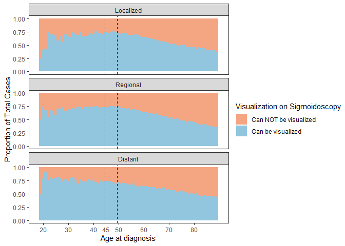<!-- -->

``` r
 # scale_fill_manual(values = c("#92c5de","#f4a582"))
```

<br>

# 5 Logistic Regression

Calculates odds of tumor in location seen on sigmoidoscopy, first
univariate then multivariate

``` r
# Code below calculates, exps, and does CI, then only saves the output to save space

sex_log<-tidy(glm(can_see_sigmoid~Sex,data=new_data5,family="binomial"),conf.int=TRUE)%>%
          mutate(estimate=exp(estimate), conf.low=exp(conf.low), conf.high=exp(conf.high))

age_log<-tidy(glm(can_see_sigmoid~age_group_final,data=new_data5,family="binomial"),conf.int=TRUE)%>%
          mutate(estimate=exp(estimate), conf.low=exp(conf.low), conf.high=exp(conf.high))

stage_log<-tidy(glm(can_see_sigmoid~new_stage,data=new_data5,family="binomial"),conf.int=TRUE)%>%
            mutate(estimate=exp(estimate), conf.low=exp(conf.low), conf.high=exp(conf.high))

year_log<-tidy(glm(can_see_sigmoid~year_of_diag,data=new_data5,family="binomial"),conf.int=TRUE)%>%
            mutate(estimate=exp(estimate), conf.low=exp(conf.low), conf.high=exp(conf.high))

race_log<-tidy(glm(can_see_sigmoid~race_eth,data=new_data5,family="binomial"),conf.int=TRUE)%>%
            mutate(estimate=exp(estimate), conf.low=exp(conf.low), conf.high=exp(conf.high))

# Multivariate, Check out interactions
multi_log<-tidy(glm(can_see_sigmoid~race_eth+Sex+age_group_final+new_stage+year_of_diag,data=new_data5,family="binomial"),conf.int=TRUE)%>%
  mutate(estimate=exp(estimate),conf.low=exp(conf.low),conf.high=exp(conf.high))
```

<br>

## 5.1 Logistic results: sex

``` r
knitr::kable(sex_log,digits=2)
```

| term        | estimate | std.error | statistic | p.value | conf.low | conf.high |
|:------------|---------:|----------:|----------:|--------:|---------:|----------:|
| (Intercept) |     1.11 |      0.01 |     19.11 |       0 |     1.10 |      1.12 |
| SexMale     |     1.54 |      0.01 |     57.05 |       0 |     1.51 |      1.56 |

## 5.2 Logistic results: age

``` r
knitr::kable(age_log,digits=2)
```

| term                   | estimate | std.error | statistic | p.value | conf.low | conf.high |
|:-----------------------|---------:|----------:|----------:|--------:|---------:|----------:|
| (Intercept)            |     1.26 |      0.00 |     58.91 |       0 |     1.25 |      1.27 |
| age_group_finalunder45 |     2.07 |      0.02 |     43.81 |       0 |     2.00 |      2.14 |
| age_group_final45-50   |     2.19 |      0.02 |     44.79 |       0 |     2.11 |      2.26 |

## 5.3 Logistic results: stage

``` r
knitr::kable(stage_log,digits=2)
```

| term              | estimate | std.error | statistic | p.value | conf.low | conf.high |
|:------------------|---------:|----------:|----------:|--------:|---------:|----------:|
| (Intercept)       |     1.29 |      0.01 |     38.48 |       0 |     1.28 |      1.31 |
| new_stageRegional |     1.04 |      0.01 |      4.82 |       0 |     1.03 |      1.06 |
| new_stageDistant  |     1.21 |      0.01 |     19.09 |       0 |     1.19 |      1.24 |

## 5.4 Logistic results: year

``` r
knitr::kable(year_log,digits=2)
```

| term             | estimate | std.error | statistic | p.value | conf.low | conf.high |
|:-----------------|---------:|----------:|----------:|--------:|---------:|----------:|
| (Intercept)      |     1.34 |      0.01 |     37.34 |    0.00 |     1.32 |      1.36 |
| year_of_diagyod2 |     1.00 |      0.01 |      0.03 |    0.98 |     0.98 |      1.02 |
| year_of_diagyod3 |     1.03 |      0.01 |      2.72 |    0.01 |     1.01 |      1.05 |
| year_of_diagyod4 |     1.08 |      0.01 |      7.77 |    0.00 |     1.06 |      1.11 |

## 5.5 Logistic results: race

``` r
knitr::kable(race_log,digits=2)
```

| term                                               | estimate | std.error | statistic | p.value | conf.low | conf.high |
|:---------------------------------------------------|---------:|----------:|----------:|--------:|---------:|----------:|
| (Intercept)                                        |     1.32 |      0.00 |     60.89 |       0 |     1.31 |      1.33 |
| race_ethHispanic (All Races)                       |     1.27 |      0.01 |     19.68 |       0 |     1.24 |      1.30 |
| race_ethNon-Hispanic American Indian/Alaska Native |     1.23 |      0.04 |      4.64 |       0 |     1.13 |      1.34 |
| race_ethNon-Hispanic Asian or Pacific Islander     |     1.60 |      0.01 |     33.45 |       0 |     1.55 |      1.64 |
| race_ethNon-Hispanic Black                         |     0.80 |      0.01 |    -18.41 |       0 |     0.78 |      0.82 |
| race_ethNon-Hispanic Unknown Race                  |     1.39 |      0.07 |      4.82 |       0 |     1.22 |      1.59 |

## 5.6 Logistic results: multivariate

``` r
knitr::kable(multi_log,digits=2)
```

| term                                               | estimate | std.error | statistic | p.value | conf.low | conf.high |
|:---------------------------------------------------|---------:|----------:|----------:|--------:|---------:|----------:|
| (Intercept)                                        |     0.96 |      0.01 |     -4.24 |    0.00 |     0.94 |      0.98 |
| race_ethHispanic (All Races)                       |     1.18 |      0.01 |     13.52 |    0.00 |     1.15 |      1.21 |
| race_ethNon-Hispanic American Indian/Alaska Native |     1.17 |      0.04 |      3.57 |    0.00 |     1.07 |      1.28 |
| race_ethNon-Hispanic Asian or Pacific Islander     |     1.56 |      0.01 |     31.49 |    0.00 |     1.52 |      1.61 |
| race_ethNon-Hispanic Black                         |     0.77 |      0.01 |    -21.27 |    0.00 |     0.75 |      0.79 |
| race_ethNon-Hispanic Unknown Race                  |     1.34 |      0.07 |      4.29 |    0.00 |     1.18 |      1.54 |
| SexMale                                            |     1.52 |      0.01 |     55.22 |    0.00 |     1.50 |      1.55 |
| age_group_finalunder45                             |     2.03 |      0.02 |     42.11 |    0.00 |     1.96 |      2.10 |
| age_group_final45-50                               |     2.15 |      0.02 |     43.26 |    0.00 |     2.07 |      2.22 |
| new_stageRegional                                  |     1.01 |      0.01 |      0.72 |    0.47 |     0.99 |      1.02 |
| new_stageDistant                                   |     1.16 |      0.01 |     14.45 |    0.00 |     1.14 |      1.18 |
| year_of_diagyod2                                   |     0.98 |      0.01 |     -2.06 |    0.04 |     0.96 |      1.00 |
| year_of_diagyod3                                   |     0.99 |      0.01 |     -1.31 |    0.19 |     0.96 |      1.01 |
| year_of_diagyod4                                   |     1.02 |      0.01 |      2.00 |    0.05 |     1.00 |      1.04 |

<br>

# 6 Survival exploration w/CSS

Makes KM curves using CSS, checks proportional hazards assumptions

## 6.1 KM plots: Can see on sigmoidoscopy

``` r
# CAN SEE
km_cansee<-survfit(Surv(survival_months, cancer_specific_status) ~ can_see_sigmoid, data = new_data5)
plot(km_cansee,fun="cloglog")
ggsurvplot(km_cansee,censor=FALSE) # BIGGEST TIME DEPENDANT!!!
```

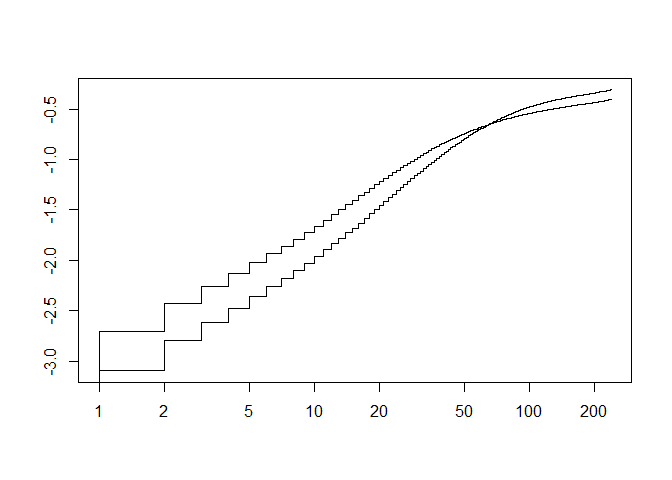<!-- -->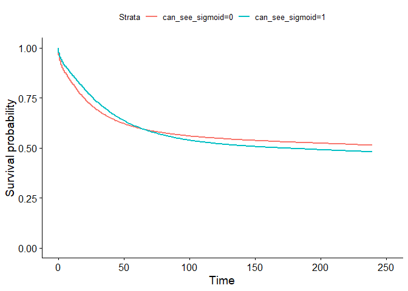<!-- -->

## 6.2 KM plots: Stage

``` r
# STAGE
km_new_stage<-survfit(Surv(survival_months, cancer_specific_status) ~new_stage, data = new_data5)
plot(km_new_stage,fun="cloglog")
```

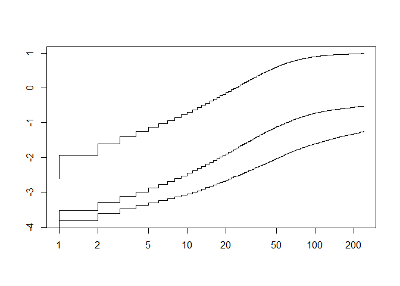<!-- -->

## 6.3 KM plots: year of diag

``` r
# YEAR OF DIAG
km_year_of_diag<-survfit(Surv(survival_months, cancer_specific_status) ~ year_of_diag, data = new_data5)
ggsurvplot(km_year_of_diag,censor=FALSE)
```

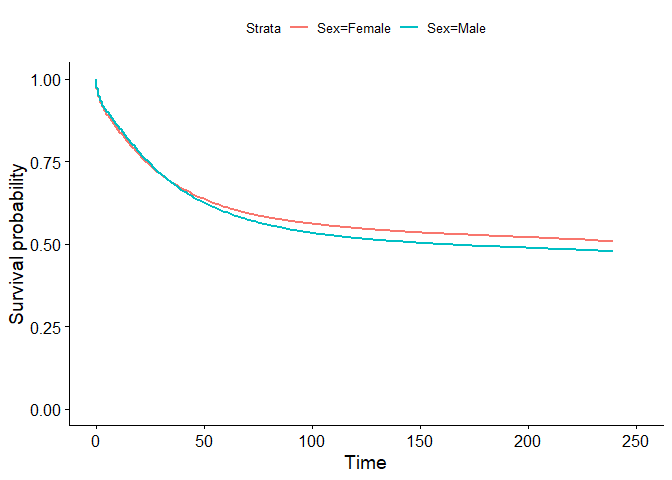<!-- -->

``` r
plot(km_year_of_diag,fun="cloglog")
```

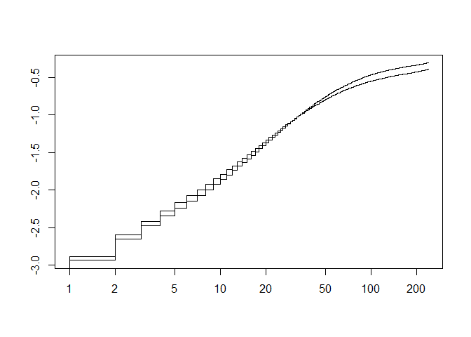<!-- -->

## 6.4 KM plots: sex

``` r
# SEX
km_Sex<-survfit(Surv(survival_months, cancer_specific_status) ~ Sex, data = new_data5)
ggsurvplot(km_Sex,censor=FALSE)
```

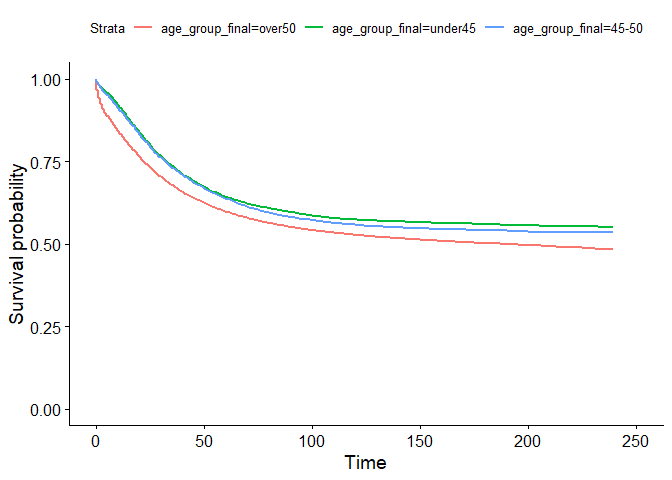<!-- -->

``` r
plot(km_Sex,fun="cloglog") # lines cross but tiny
```

<!-- -->

## 6.5 KM plots: age group

``` r
# AGE GROUP
km_age_group_final<-survfit(Surv(survival_months, cancer_specific_status) ~ age_group_final, data = new_data5)
ggsurvplot(km_age_group_final,censor=FALSE) # lines cross but tiny
```

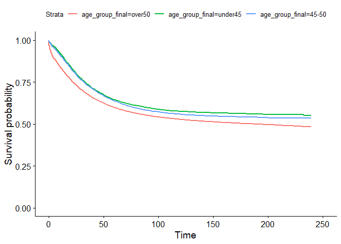<!-- -->

``` r
plot(km_age_group_final,fun="cloglog") 
```

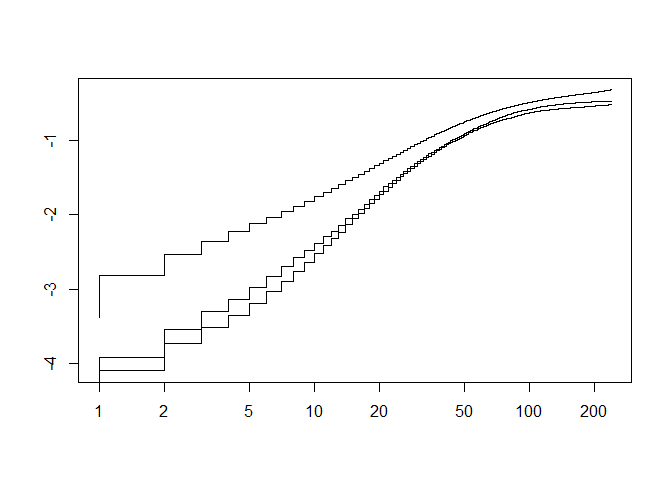<!-- -->

## 6.6 KM plots: race/eth

``` r
# RACE ETH
km_race_eth<-survfit(Surv(survival_months, cancer_specific_status) ~ race_eth, data = new_data5)
ggsurvplot(km_race_eth,censor=FALSE) # lines cross but insignificant 
```

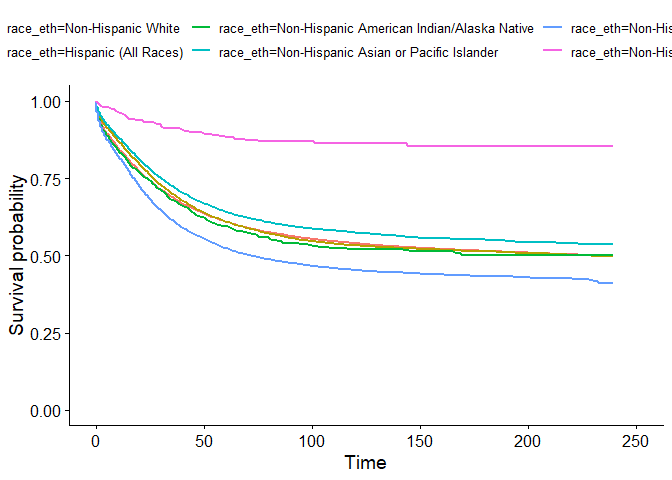<!-- -->

``` r
plot(km_race_eth,fun="cloglog") 
```

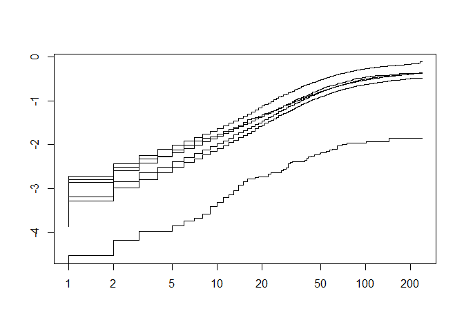<!-- -->

## 6.7 KM plots: Site

``` r
# SITE (this is just can see sigmoid with more definition)
km_site<-survfit(Surv(survival_months, cancer_specific_status) ~ primary_site, data = new_data5)
ggsurvplot(km_site,censor=FALSE,ylim=c(0.5,1),xlim=c(0,100))
```

    ## Warning: Removed 320 rows containing missing values (`geom_step()`).
    ## Removed 320 rows containing missing values (`geom_step()`).

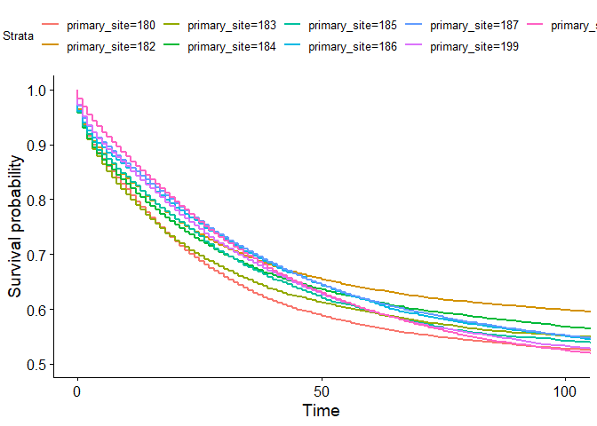<!-- -->

``` r
#table(new_data5$primary_site)
```

<br>

# 7 Survival Analysis

``` r
# Make sure to not take out the 0 month patients here!
new_data6<-new_data5#%>%filter(survival_months>0)
new_data7<- new_data6%>%select(survival_months,cancer_specific_status,can_see_sigmoid,age_group_final,new_stage,overall_status)

# computes rmst with age group as a covariate, takes dataframe, vector of time points, and the stage as inputs, returns a data frame with results across time points in columns, rows are the stats we are looking at (add option to switch to OS)
compute_rmst_with_age <- function(data,time_points,stage,css=TRUE){
  
  data<-new_data7
  stage="Localized"
  data<-data %>% filter(new_stage==stage)
  covs<-model.matrix(~age_group_final*can_see_sigmoid,data=data)
  
  
  rms_combined <- data.frame(col1="rmst")
  
  for (t in time_points){
    # calcs rmst with alpha corrected for 3 stages and number of time points 
    if (css) {
       rms_temp <- rmst2(time=data$survival_months,status=data$cancer_specific_status,arm=data$can_see_sigmoid,covariates=covs,tau=t,alpha=0.05/(3*length(time_points)) )
    }else{
       rms_temp <- rmst2(time=data$survival_months,status=data$overall_status,arm=data$can_see_sigmoid,covariates=covs,tau=t,alpha=0.05/(3*length(time_points)) )
    }
   
    # round and add results to the data frame, each time point will be added as a block of columns 
    rms_temp_res <- data.frame(rms_temp$RMST.difference.adjusted) %>% select(-se.coef., -z ) %>% mutate_all((function(x) round(x,digits=3))) %>% setNames( paste0('m_',t,"_",names(.)) )
    rms_combined <- cbind(rms_combined,rms_temp_res)
  }
  
  return(rms_combined)
}

# Compute RMST individually
compute_rmst_individually <- function(data,time_points,stage,css=TRUE){
  
  data<-data %>% filter(new_stage==stage)
  
  u45<-data%>%filter(age_group_final=="under45")
  mid<-data%>%filter(age_group_final=="45-50")
  o50<-data%>%filter(age_group_final=="over50")
  data_list <- list(u45,mid,o50)
  
  rms_combined_res = list()
  agegroup = c("u45","mid","o50")
  i=1
  for (age_data in data_list){
    
    rms_combined <- data.frame(col1="rmst")
    
    for (t in time_points){
      # calcs rmst with alpha corrected for 3 stages and number of time points 
      if (css) {
         rms_temp <- rmst2(time=age_data$survival_months,status=age_data$cancer_specific_status,arm=age_data$can_see_sigmoid,tau=t,alpha=0.05/(3*3*length(time_points)) )
      }else{
         rms_temp <- rmst2(time=age_data$survival_months,status=age_data$overall_status,arm=age_data$can_see_sigmoid,tau=t,alpha=0.05/(3*length(time_points)) )
      }
      
      
      # round and add results to the data frame, each time point will be added as a block of columns 
      rms_temp_res <- data.frame(rms_temp$unadjusted.result)[1,] %>% mutate_all((function(x) round(x,digits=3))) #%>% setNames( paste0('m_',t,"_",names(.)) )
      colnames(rms_temp_res) <- c(paste0("Diff ",t),paste0("Low CI ",t), paste0("Up CI ",t), paste0("p val ",t))
      rms_combined <- cbind(rms_combined,rms_temp_res)
    }
    
  rms_combined_res[[paste0(agegroup[i])]] <- rms_combined
  i=i+1
  }
  rms_combined_res_final <- do.call(rbind,rms_combined_res)
  return(rms_combined_res_final)
}


# THIS FUNCTION DOESNT WORK JUST EXPERIMENTAL
compute_rmst_all <- function(data, time_points, css=TRUE){
  
  data=new_data7
  covs<-model.matrix(~age_group_final*can_see_sigmoid*new_stage,data=data)
  covs<-covs[,-1]
  rms_combined <- data.frame(col1="rmst")
  
  rms_temp <- rmst2(time=data$survival_months,status=data$cancer_specific_status,arm=data$can_see_sigmoid,covariates=covs,tau=60,alpha=0.05)
  
  for (t in time_points){
    # calcs rmst with alpha corrected for 3 stages and number of time points 
    if (css) {
       rms_temp <- rmst2(time=data$survival_months,status=data$cancer_specific_status,arm=data$can_see_sigmoid,covariates=covs,tau=t,alpha=0.05/(3*length(time_points)) )
    }else{
       rms_temp <- rmst2(time=data$survival_months,status=data$overall_status,arm=data$can_see_sigmoid,covariates=covs,tau=t,alpha=0.05/(3*length(time_points)) )
    }
   
    # round and add results to the data frame, each time point will be added as a block of columns 
    rms_temp_res <- data.frame(rms_temp$RMST.difference.adjusted) %>% select(-se.coef., -z ) %>% mutate_all((function(x) round(x,digits=3))) %>% setNames( paste0('m_',t,"_",names(.)) )
    rms_combined <- cbind(rms_combined,rms_temp_res)
  }
  return(rms_combined)
  
}

local_res_combined_css <- compute_rmst_individually(new_data7,c(12,24,60,120),"Localized")
regional_res_combined_css <- compute_rmst_individually(new_data7,c(12,24,60,120),"Regional")
distant_res_combined_css <- compute_rmst_individually(new_data7,c(12,24,60,120),"Distant")

local_res_combined_os <- compute_rmst_individually(new_data7,c(12,24,60,120),"Localized",FALSE)
regional_res_combined_os <- compute_rmst_individually(new_data7,c(12,24,60,120),"Regional",FALSE)
distant_res_combined_os <- compute_rmst_individually(new_data7,c(12,24,60,120),"Distant",FALSE)
```

<br>

## 7.1 CSS

### 7.1.1 Local

``` r
knitr::kable(local_res_combined_css,digits=3)
```

|     | col1 | Diff 12 | Low CI 12 | Up CI 12 | p val 12 | Diff 24 | Low CI 24 | Up CI 24 | p val 24 | Diff 60 | Low CI 60 | Up CI 60 | p val 60 | Diff 120 | Low CI 120 | Up CI 120 | p val 120 |
|-----|:-----|--------:|----------:|---------:|---------:|--------:|----------:|---------:|---------:|--------:|----------:|----------|---------:|----------|-----------:|----------:|-----------|
| u45 | rmst |  -0.001 |    -0.093 |    0.091 |    0.976 |  -0.078 |    -0.296 |    0.140 |    0.251 |  -1.014 |    -1.871 | -0.157   |    0.000 | -4.833   |     -7.435 |    -2.230 | 0         |
| mid | rmst |  -0.031 |    -0.114 |    0.051 |    0.223 |  -0.121 |    -0.318 |    0.077 |    0.051 |  -0.766 |    -1.629 | 0.097    |    0.005 | -3.681   |     -6.385 |    -0.976 | 0         |
| o50 | rmst |   0.036 |    -0.011 |    0.084 |    0.015 |   0.006 |    -0.104 |    0.116 |    0.865 |  -0.720 |    -1.071 | -0.368   |    0.000 | -3.540   |     -4.420 |    -2.660 | 0         |

### 7.1.2 Regional

``` r
knitr::kable(regional_res_combined_css,digits=3)
```

|     | col1 | Diff 12 | Low CI 12 | Up CI 12 | p val 12 | Diff 24 | Low CI 24 | Up CI 24 | p val 24 | Diff 60 | Low CI 60 | Up CI 60 | p val 60 | Diff 120 | Low CI 120 | Up CI 120 | p val 120 |
|-----|:-----|---------|----------:|---------:|----------|---------|----------:|---------:|----------|---------|----------:|---------:|----------|---------:|-----------:|----------:|----------:|
| u45 | rmst | 0.139   |     0.048 |    0.231 | 0        | 0.569   |     0.291 |    0.846 | 0        | 1.765   |     0.582 |    2.948 | 0        |    0.574 |     -2.602 |     3.750 |     0.564 |
| mid | rmst | 0.133   |     0.027 |    0.240 | 0        | 0.489   |     0.185 |    0.793 | 0        | 1.947   |     0.647 |    3.246 | 0        |    2.196 |     -1.347 |     5.739 |     0.048 |
| o50 | rmst | 0.336   |     0.285 |    0.387 | 0        | 0.982   |     0.859 |    1.106 | 0        | 2.875   |     2.468 |    3.282 | 0        |    3.533 |      2.542 |     4.524 |     0.000 |

### 7.1.3 Distant

``` r
knitr::kable(distant_res_combined_css,digits=3)
```

|     | col1 | Diff 12 | Low CI 12 | Up CI 12 | p val 12 | Diff 24 | Low CI 24 | Up CI 24 | p val 24 | Diff 60 | Low CI 60 | Up CI 60 | p val 60 | Diff 120 | Low CI 120 | Up CI 120 | p val 120 |
|-----|:-----|---------|----------:|---------:|----------|---------|----------:|---------:|----------|---------|----------:|---------:|----------|---------:|-----------:|----------:|-----------|
| u45 | rmst | 0.630   |     0.298 |    0.963 | 0        | 2.132   |     1.348 |    2.916 | 0        | 5.499   |     3.460 |    7.538 | 0        |    7.286 |      3.257 |    11.314 | 0         |
| mid | rmst | 1.005   |     0.631 |    1.378 | 0        | 2.938   |     2.098 |    3.779 | 0        | 7.039   |     4.988 |    9.090 | 0        |    9.692 |      5.866 |    13.518 | 0         |
| o50 | rmst | 1.122   |     0.998 |    1.245 | 0        | 2.668   |     2.416 |    2.920 | 0        | 5.701   |     5.158 |    6.243 | 0        |    7.616 |      6.677 |     8.556 | 0         |

<br>

## 7.2 OS

### 7.2.1 Local

``` r
knitr::kable(local_res_combined_os,digits=3)
```

|     | col1 | Diff 12 | Low CI 12 | Up CI 12 | p val 12 | Diff 24 | Low CI 24 | Up CI 24 | p val 24 | Diff 60 | Low CI 60 | Up CI 60 | p val 60 | Diff 120 | Low CI 120 | Up CI 120 | p val 120 |
|-----|:-----|--------:|----------:|---------:|---------:|--------:|----------:|---------:|---------:|--------:|----------:|----------|---------:|----------|-----------:|----------:|-----------|
| u45 | rmst |   0.017 |    -0.084 |    0.117 |    0.637 |  -0.017 |    -0.263 |    0.228 |    0.838 |  -0.750 |    -1.678 | 0.178    |    0.021 | -3.787   |     -6.496 |    -1.077 | 0         |
| mid | rmst |  -0.040 |    -0.149 |    0.069 |    0.291 |  -0.182 |    -0.436 |    0.071 |    0.040 |  -1.022 |    -2.010 | -0.034   |    0.003 | -4.260   |     -7.173 |    -1.346 | 0         |
| o50 | rmst |   0.142 |     0.086 |    0.199 |    0.000 |   0.302 |     0.172 |    0.432 |    0.000 |   0.772 |     0.369 | 1.175    |    0.000 | 2.630    |      1.679 |     3.581 | 0         |

### 7.2.2 Regional

``` r
knitr::kable(regional_res_combined_os,digits=3)
```

|     | col1 | Diff 12 | Low CI 12 | Up CI 12 | p val 12 | Diff 24 | Low CI 24 | Up CI 24 | p val 24 | Diff 60 | Low CI 60 | Up CI 60 | p val 60 | Diff 120 | Low CI 120 | Up CI 120 | p val 120 |
|-----|:-----|---------|----------:|---------:|----------|---------|----------:|---------:|----------|---------|----------:|---------:|----------|---------:|-----------:|----------:|----------:|
| u45 | rmst | 0.199   |     0.103 |    0.295 | 0        | 0.726   |     0.448 |    1.005 | 0        | 2.196   |     1.078 |    3.315 | 0        |    1.586 |     -1.351 |     4.523 |     0.122 |
| mid | rmst | 0.138   |     0.033 |    0.243 | 0        | 0.509   |     0.217 |    0.800 | 0        | 1.967   |     0.759 |    3.176 | 0        |    2.523 |     -0.722 |     5.768 |     0.026 |
| o50 | rmst | 0.471   |     0.417 |    0.526 | 0        | 1.309   |     1.182 |    1.436 | 0        | 4.064   |     3.675 |    4.453 | 0        |    7.754 |      6.881 |     8.627 |     0.000 |

### 7.2.3 Distant

``` r
knitr::kable(distant_res_combined_os,digits=3)
```

|     | col1 | Diff 12 | Low CI 12 | Up CI 12 | p val 12 | Diff 24 | Low CI 24 | Up CI 24 | p val 24 | Diff 60 | Low CI 60 | Up CI 60 | p val 60 | Diff 120 | Low CI 120 | Up CI 120 | p val 120 |
|-----|:-----|---------|----------:|---------:|----------|---------|----------:|---------:|----------|---------|----------:|---------:|----------|---------:|-----------:|----------:|-----------|
| u45 | rmst | 0.632   |     0.330 |    0.935 | 0        | 2.134   |     1.429 |    2.840 | 0        | 5.615   |     3.836 |    7.394 | 0        |    7.404 |      3.979 |    10.829 | 0         |
| mid | rmst | 1.046   |     0.707 |    1.386 | 0        | 3.019   |     2.265 |    3.774 | 0        | 7.157   |     5.364 |    8.950 | 0        |    9.731 |      6.482 |    12.980 | 0         |
| o50 | rmst | 1.156   |     1.045 |    1.268 | 0        | 2.670   |     2.447 |    2.893 | 0        | 5.491   |     5.032 |    5.949 | 0        |    7.125 |      6.381 |     7.869 | 0         |

<br><br>

# 8 KM Plots with better 95% CIs

``` r
font_import()
```

    ## Importing fonts may take a few minutes, depending on the number of fonts and the speed of the system.
    ## Continue? [y/n]

    ## Exiting.

``` r
loadfonts(device = "win")
```

    ## Agency FB already registered with windowsFonts().

    ## Algerian already registered with windowsFonts().

    ## Arial Black already registered with windowsFonts().

    ## Arial already registered with windowsFonts().

    ## Arial Narrow already registered with windowsFonts().

    ## Arial Rounded MT Bold already registered with windowsFonts().

    ## Bahnschrift already registered with windowsFonts().

    ## Baskerville Old Face already registered with windowsFonts().

    ## Bauhaus 93 already registered with windowsFonts().

    ## Bell MT already registered with windowsFonts().

    ## Berlin Sans FB already registered with windowsFonts().

    ## Berlin Sans FB Demi already registered with windowsFonts().

    ## Bernard MT Condensed already registered with windowsFonts().

    ## Blackadder ITC already registered with windowsFonts().

    ## Bodoni MT already registered with windowsFonts().

    ## Bodoni MT Black already registered with windowsFonts().

    ## Bodoni MT Condensed already registered with windowsFonts().

    ## Bodoni MT Poster Compressed already registered with windowsFonts().

    ## Book Antiqua already registered with windowsFonts().

    ## Bookman Old Style already registered with windowsFonts().

    ## Bookshelf Symbol 7 already registered with windowsFonts().

    ## Bradley Hand ITC already registered with windowsFonts().

    ## Britannic Bold already registered with windowsFonts().

    ## Broadway already registered with windowsFonts().

    ## Brush Script MT already registered with windowsFonts().

    ## Calibri already registered with windowsFonts().

    ## Calibri Light already registered with windowsFonts().

    ## Californian FB already registered with windowsFonts().

    ## Calisto MT already registered with windowsFonts().

    ## Cambria already registered with windowsFonts().

    ## Candara already registered with windowsFonts().

    ## Candara Light already registered with windowsFonts().

    ## Cascadia Code already registered with windowsFonts().

    ## Cascadia Mono already registered with windowsFonts().

    ## Castellar already registered with windowsFonts().

    ## Centaur already registered with windowsFonts().

    ## Century already registered with windowsFonts().

    ## Century Gothic already registered with windowsFonts().

    ## Century Schoolbook already registered with windowsFonts().

    ## Chiller already registered with windowsFonts().

    ## Colonna MT already registered with windowsFonts().

    ## Comic Sans MS already registered with windowsFonts().

    ## Consolas already registered with windowsFonts().

    ## Constantia already registered with windowsFonts().

    ## Cooper Black already registered with windowsFonts().

    ## Copperplate Gothic Bold already registered with windowsFonts().

    ## Copperplate Gothic Light already registered with windowsFonts().

    ## Corbel already registered with windowsFonts().

    ## Corbel Light already registered with windowsFonts().

    ## Courier New already registered with windowsFonts().

    ## Curlz MT already registered with windowsFonts().

    ## Dubai already registered with windowsFonts().

    ## Dubai Light already registered with windowsFonts().

    ## Dubai Medium already registered with windowsFonts().

    ## Ebrima already registered with windowsFonts().

    ## Edwardian Script ITC already registered with windowsFonts().

    ## Elephant already registered with windowsFonts().

    ## Engravers MT already registered with windowsFonts().

    ## Eras Bold ITC already registered with windowsFonts().

    ## Eras Demi ITC already registered with windowsFonts().

    ## Eras Light ITC already registered with windowsFonts().

    ## Eras Medium ITC already registered with windowsFonts().

    ## Felix Titling already registered with windowsFonts().

    ## Footlight MT Light already registered with windowsFonts().

    ## Forte already registered with windowsFonts().

    ## Franklin Gothic Book already registered with windowsFonts().

    ## Franklin Gothic Demi already registered with windowsFonts().

    ## Franklin Gothic Demi Cond already registered with windowsFonts().

    ## Franklin Gothic Heavy already registered with windowsFonts().

    ## Franklin Gothic Medium already registered with windowsFonts().

    ## Franklin Gothic Medium Cond already registered with windowsFonts().

    ## Freestyle Script already registered with windowsFonts().

    ## French Script MT already registered with windowsFonts().

    ## Gabriola already registered with windowsFonts().

    ## Gadugi already registered with windowsFonts().

    ## Garamond already registered with windowsFonts().

    ## Georgia already registered with windowsFonts().

    ## Gigi already registered with windowsFonts().

    ## Gill Sans Ultra Bold already registered with windowsFonts().

    ## Gill Sans Ultra Bold Condensed already registered with windowsFonts().

    ## Gill Sans MT already registered with windowsFonts().

    ## Gill Sans MT Condensed already registered with windowsFonts().

    ## Gill Sans MT Ext Condensed Bold already registered with windowsFonts().

    ## Gloucester MT Extra Condensed already registered with windowsFonts().

    ## Goudy Old Style already registered with windowsFonts().

    ## Goudy Stout already registered with windowsFonts().

    ## Haettenschweiler already registered with windowsFonts().

    ## Harlow Solid Italic already registered with windowsFonts().

    ## Harrington already registered with windowsFonts().

    ## High Tower Text already registered with windowsFonts().

    ## HoloLens MDL2 Assets already registered with windowsFonts().

    ## Impact already registered with windowsFonts().

    ## Imprint MT Shadow already registered with windowsFonts().

    ## Informal Roman already registered with windowsFonts().

    ## Ink Free already registered with windowsFonts().

    ## Javanese Text already registered with windowsFonts().

    ## Jokerman already registered with windowsFonts().

    ## Juice ITC already registered with windowsFonts().

    ## Kristen ITC already registered with windowsFonts().

    ## Kunstler Script already registered with windowsFonts().

    ## Wide Latin already registered with windowsFonts().

    ## Leelawadee UI already registered with windowsFonts().

    ## Leelawadee UI Semilight already registered with windowsFonts().

    ## Lucida Bright already registered with windowsFonts().

    ## Lucida Calligraphy already registered with windowsFonts().

    ## Lucida Console already registered with windowsFonts().

    ## Lucida Fax already registered with windowsFonts().

    ## Lucida Handwriting already registered with windowsFonts().

    ## Lucida Sans already registered with windowsFonts().

    ## Lucida Sans Typewriter already registered with windowsFonts().

    ## Lucida Sans Unicode already registered with windowsFonts().

    ## Magneto already registered with windowsFonts().

    ## Maiandra GD already registered with windowsFonts().

    ## Malgun Gothic already registered with windowsFonts().

    ## Malgun Gothic Semilight already registered with windowsFonts().

    ## Marlett already registered with windowsFonts().

    ## Matura MT Script Capitals already registered with windowsFonts().

    ## Microsoft Himalaya already registered with windowsFonts().

    ## Microsoft Yi Baiti already registered with windowsFonts().

    ## Microsoft New Tai Lue already registered with windowsFonts().

    ## Microsoft PhagsPa already registered with windowsFonts().

    ## Microsoft Sans Serif already registered with windowsFonts().

    ## Microsoft Tai Le already registered with windowsFonts().

    ## Mistral already registered with windowsFonts().

    ## Modern No. 20 already registered with windowsFonts().

    ## Mongolian Baiti already registered with windowsFonts().

    ## Monotype Corsiva already registered with windowsFonts().

    ## MS Outlook already registered with windowsFonts().

    ## MS Reference Sans Serif already registered with windowsFonts().

    ## MS Reference Specialty already registered with windowsFonts().

    ## MT Extra already registered with windowsFonts().

    ## MV Boli already registered with windowsFonts().

    ## Myanmar Text already registered with windowsFonts().

    ## Niagara Engraved already registered with windowsFonts().

    ## Niagara Solid already registered with windowsFonts().

    ## Nirmala UI already registered with windowsFonts().

    ## Nirmala UI Semilight already registered with windowsFonts().

    ## OCR A Extended already registered with windowsFonts().

    ## Old English Text MT already registered with windowsFonts().

    ## Onyx already registered with windowsFonts().

    ## Palace Script MT already registered with windowsFonts().

    ## Palatino Linotype already registered with windowsFonts().

    ## Papyrus already registered with windowsFonts().

    ## Parchment already registered with windowsFonts().

    ## Perpetua already registered with windowsFonts().

    ## Perpetua Titling MT already registered with windowsFonts().

    ## Playbill already registered with windowsFonts().

    ## Poor Richard already registered with windowsFonts().

    ## Pristina already registered with windowsFonts().

    ## Rage Italic already registered with windowsFonts().

    ## Raleway Black already registered with windowsFonts().

    ## Raleway already registered with windowsFonts().

    ## Raleway ExtraBold already registered with windowsFonts().

    ## Raleway ExtraLight already registered with windowsFonts().

    ## Raleway Light already registered with windowsFonts().

    ## Raleway Medium already registered with windowsFonts().

    ## Raleway SemiBold already registered with windowsFonts().

    ## Raleway Thin already registered with windowsFonts().

    ## Ravie already registered with windowsFonts().

    ## Rockwell already registered with windowsFonts().

    ## Rockwell Condensed already registered with windowsFonts().

    ## Rockwell Extra Bold already registered with windowsFonts().

    ## Rubik Black already registered with windowsFonts().

    ## Rubik already registered with windowsFonts().

    ## Rubik ExtraBold already registered with windowsFonts().

    ## Rubik Light already registered with windowsFonts().

    ## Rubik Medium already registered with windowsFonts().

    ## Rubik SemiBold already registered with windowsFonts().

    ## Script MT Bold already registered with windowsFonts().

    ## Segoe MDL2 Assets already registered with windowsFonts().

    ## Segoe Print already registered with windowsFonts().

    ## Segoe Script already registered with windowsFonts().

    ## Segoe UI already registered with windowsFonts().

    ## Segoe UI Light already registered with windowsFonts().

    ## Segoe UI Semibold already registered with windowsFonts().

    ## Segoe UI Semilight already registered with windowsFonts().

    ## Segoe UI Black already registered with windowsFonts().

    ## Segoe UI Emoji already registered with windowsFonts().

    ## Segoe UI Historic already registered with windowsFonts().

    ## Segoe UI Symbol already registered with windowsFonts().

    ## Showcard Gothic already registered with windowsFonts().

    ## SimSun-ExtB already registered with windowsFonts().

    ## Snap ITC already registered with windowsFonts().

    ## Stencil already registered with windowsFonts().

    ## Sylfaen already registered with windowsFonts().

    ## Symbol already registered with windowsFonts().

    ## Tahoma already registered with windowsFonts().

    ## Tempus Sans ITC already registered with windowsFonts().

    ## Times New Roman already registered with windowsFonts().

    ## Trebuchet MS already registered with windowsFonts().

    ## Tw Cen MT already registered with windowsFonts().

    ## Tw Cen MT Condensed already registered with windowsFonts().

    ## Tw Cen MT Condensed Extra Bold already registered with windowsFonts().

    ## Unispace already registered with windowsFonts().

    ## Verdana already registered with windowsFonts().

    ## Viner Hand ITC already registered with windowsFonts().

    ## Vivaldi already registered with windowsFonts().

    ## Vladimir Script already registered with windowsFonts().

    ## Webdings already registered with windowsFonts().

    ## Wingdings already registered with windowsFonts().

    ## Wingdings 2 already registered with windowsFonts().

    ## Wingdings 3 already registered with windowsFonts().

    ## ZWAdobeF already registered with windowsFonts().

``` r
fonts()
```

    ##   [1] "Agency FB"                       "Algerian"                       
    ##   [3] "Arial Black"                     "Arial"                          
    ##   [5] "Arial Narrow"                    "Arial Rounded MT Bold"          
    ##   [7] "Bahnschrift"                     "Baskerville Old Face"           
    ##   [9] "Bauhaus 93"                      "Bell MT"                        
    ##  [11] "Berlin Sans FB"                  "Berlin Sans FB Demi"            
    ##  [13] "Bernard MT Condensed"            "Blackadder ITC"                 
    ##  [15] "Bodoni MT"                       "Bodoni MT Black"                
    ##  [17] "Bodoni MT Condensed"             "Bodoni MT Poster Compressed"    
    ##  [19] "Book Antiqua"                    "Bookman Old Style"              
    ##  [21] "Bookshelf Symbol 7"              "Bradley Hand ITC"               
    ##  [23] "Britannic Bold"                  "Broadway"                       
    ##  [25] "Brush Script MT"                 "Calibri"                        
    ##  [27] "Calibri Light"                   "Californian FB"                 
    ##  [29] "Calisto MT"                      "Cambria"                        
    ##  [31] "Candara"                         "Candara Light"                  
    ##  [33] "Cascadia Code"                   "Cascadia Mono"                  
    ##  [35] "Castellar"                       "Centaur"                        
    ##  [37] "Century"                         "Century Gothic"                 
    ##  [39] "Century Schoolbook"              "Chiller"                        
    ##  [41] "Colonna MT"                      "Comic Sans MS"                  
    ##  [43] "Consolas"                        "Constantia"                     
    ##  [45] "Cooper Black"                    "Copperplate Gothic Bold"        
    ##  [47] "Copperplate Gothic Light"        "Corbel"                         
    ##  [49] "Corbel Light"                    "Courier New"                    
    ##  [51] "Curlz MT"                        "Dubai"                          
    ##  [53] "Dubai Light"                     "Dubai Medium"                   
    ##  [55] "Ebrima"                          "Edwardian Script ITC"           
    ##  [57] "Elephant"                        "Engravers MT"                   
    ##  [59] "Eras Bold ITC"                   "Eras Demi ITC"                  
    ##  [61] "Eras Light ITC"                  "Eras Medium ITC"                
    ##  [63] "Felix Titling"                   "Footlight MT Light"             
    ##  [65] "Forte"                           "Franklin Gothic Book"           
    ##  [67] "Franklin Gothic Demi"            "Franklin Gothic Demi Cond"      
    ##  [69] "Franklin Gothic Heavy"           "Franklin Gothic Medium"         
    ##  [71] "Franklin Gothic Medium Cond"     "Freestyle Script"               
    ##  [73] "French Script MT"                "Gabriola"                       
    ##  [75] "Gadugi"                          "Garamond"                       
    ##  [77] "Georgia"                         "Gigi"                           
    ##  [79] "Gill Sans Ultra Bold"            "Gill Sans Ultra Bold Condensed" 
    ##  [81] "Gill Sans MT"                    "Gill Sans MT Condensed"         
    ##  [83] "Gill Sans MT Ext Condensed Bold" "Gloucester MT Extra Condensed"  
    ##  [85] "Goudy Old Style"                 "Goudy Stout"                    
    ##  [87] "Haettenschweiler"                "Harlow Solid Italic"            
    ##  [89] "Harrington"                      "High Tower Text"                
    ##  [91] "HoloLens MDL2 Assets"            "Impact"                         
    ##  [93] "Imprint MT Shadow"               "Informal Roman"                 
    ##  [95] "Ink Free"                        "Javanese Text"                  
    ##  [97] "Jokerman"                        "Juice ITC"                      
    ##  [99] "Kristen ITC"                     "Kunstler Script"                
    ## [101] "Wide Latin"                      "Leelawadee UI"                  
    ## [103] "Leelawadee UI Semilight"         "Lucida Bright"                  
    ## [105] "Lucida Calligraphy"              "Lucida Console"                 
    ## [107] "Lucida Fax"                      "Lucida Handwriting"             
    ## [109] "Lucida Sans"                     "Lucida Sans Typewriter"         
    ## [111] "Lucida Sans Unicode"             "Magneto"                        
    ## [113] "Maiandra GD"                     "Malgun Gothic"                  
    ## [115] "Malgun Gothic Semilight"         "Marlett"                        
    ## [117] "Matura MT Script Capitals"       "Microsoft Himalaya"             
    ## [119] "Microsoft Yi Baiti"              "Microsoft New Tai Lue"          
    ## [121] "Microsoft PhagsPa"               "Microsoft Sans Serif"           
    ## [123] "Microsoft Tai Le"                "Mistral"                        
    ## [125] "Modern No. 20"                   "Mongolian Baiti"                
    ## [127] "Monotype Corsiva"                "MS Outlook"                     
    ## [129] "MS Reference Sans Serif"         "MS Reference Specialty"         
    ## [131] "MT Extra"                        "MV Boli"                        
    ## [133] "Myanmar Text"                    "Niagara Engraved"               
    ## [135] "Niagara Solid"                   "Nirmala UI"                     
    ## [137] "Nirmala UI Semilight"            "OCR A Extended"                 
    ## [139] "Old English Text MT"             "Onyx"                           
    ## [141] "Palace Script MT"                "Palatino Linotype"              
    ## [143] "Papyrus"                         "Parchment"                      
    ## [145] "Perpetua"                        "Perpetua Titling MT"            
    ## [147] "Playbill"                        "Poor Richard"                   
    ## [149] "Pristina"                        "Rage Italic"                    
    ## [151] "Raleway Black"                   "Raleway"                        
    ## [153] "Raleway ExtraBold"               "Raleway ExtraLight"             
    ## [155] "Raleway Light"                   "Raleway Medium"                 
    ## [157] "Raleway SemiBold"                "Raleway Thin"                   
    ## [159] "Ravie"                           "Rockwell"                       
    ## [161] "Rockwell Condensed"              "Rockwell Extra Bold"            
    ## [163] "Rubik Black"                     "Rubik"                          
    ## [165] "Rubik ExtraBold"                 "Rubik Light"                    
    ## [167] "Rubik Medium"                    "Rubik SemiBold"                 
    ## [169] "Script MT Bold"                  "Segoe MDL2 Assets"              
    ## [171] "Segoe Print"                     "Segoe Script"                   
    ## [173] "Segoe UI"                        "Segoe UI Light"                 
    ## [175] "Segoe UI Semibold"               "Segoe UI Semilight"             
    ## [177] "Segoe UI Black"                  "Segoe UI Emoji"                 
    ## [179] "Segoe UI Historic"               "Segoe UI Symbol"                
    ## [181] "Showcard Gothic"                 "SimSun-ExtB"                    
    ## [183] "Snap ITC"                        "Stencil"                        
    ## [185] "Sylfaen"                         "Symbol"                         
    ## [187] "Tahoma"                          "Tempus Sans ITC"                
    ## [189] "Times New Roman"                 "Trebuchet MS"                   
    ## [191] "Tw Cen MT"                       "Tw Cen MT Condensed"            
    ## [193] "Tw Cen MT Condensed Extra Bold"  "Unispace"                       
    ## [195] "Verdana"                         "Viner Hand ITC"                 
    ## [197] "Vivaldi"                         "Vladimir Script"                
    ## [199] "Webdings"                        "Wingdings"                      
    ## [201] "Wingdings 2"                     "Wingdings 3"                    
    ## [203] "ZWAdobeF"

``` r
options(device = "windows")

# makes a KM fit and calcs logep 95% CIs, returns the data for use with ggplot. Takes full dataset, age group and stage as strings, TRUE for CSS and FALSE for OS
make_plot_dat <- function(data_set, age_grp, stage, css = TRUE){
  
  # make a can and no can see set
  can <- data_set%>%filter(age_group_final==age_grp,new_stage==stage,can_see_sigmoid==1)
  nocan <- data_set%>%filter(age_group_final==age_grp,new_stage==stage,can_see_sigmoid==0)
  
  # fit to css or os
  if (css){
    fit1 <- surv_fit(Surv(survival_months,cancer_specific_status)~1,data=can)
    fit2 <-  surv_fit(Surv(survival_months,cancer_specific_status)~1,data=nocan)
  }else{
    fit1 <- surv_fit(Surv(survival_months,overall_status)~1,data=can)
    fit2 <- surv_fit(Surv(survival_months,overall_status)~1,data=nocan)
  }
  
  # compute the logep CIs (more appropriate for comparing across the whole curve)
  fit1 <- km.ci(fit1,conf.level = 0.95,method = "logep")
  fit2 <- km.ci(fit2,conf.level = 0.95,method = "logep")
  
  # extract and return data needed to generate plots
  pltdat1 <- as.data.frame(cbind(fit1$surv,fit1$time,fit1$n.risk,fit1$n.event,fit1$lower,fit1$upper))%>%mutate(type="cansee")
  pltdat2 <- as.data.frame(cbind(fit2$surv,fit2$time,fit2$n.risk,fit2$n.event,fit2$lower,fit2$upper))%>%mutate(type="cant see")
  
  colnames(pltdat1)<-c("surv","time","nrisk","nevent","lower","upper","type")
  colnames(pltdat2)<-c("surv","time","nrisk","nevent","lower","upper","type")

  plt3 <- rbind(pltdat1,pltdat2)
  return(plt3)
}

make_plot <- function(plot_dat,fig_title){# takes in plot data generated from make_plot_dat plus a string as the fig title, returns ggplot object of KM plot
  
  p <- ggplot(plot_dat ,aes(x=time,y=surv,color=type))+
    geom_step()+
    # set custom y axis limits, might actually want to just have the at 0,1 for all graphs 
    ylim(if(str_detect(fig_title,"Distant")) c(0,1) else c(0,1))+
    geom_ribbon(aes(ymin=lower,ymax=upper,x=time,fill=type),alpha=.2,size=0.1)+
    ggtitle(fig_title)+theme_test()+
    theme(
      plot.title = element_text(size=10),
      axis.title = element_blank(),
      panel.grid.major.x = element_line(linewidth=0.2,linetype = 3),
      text = element_text(family = "Calibri"))+
    # x axis breaks at 2,5,10, and 15 years
    scale_x_continuous(limits=c(0,240),breaks=c(0,24,60,120,180),labels=c("0","2","5","10","15"))+
    labs(fill="Tumor Location",color="Tumor Location")+
    scale_fill_manual(labels= c("Can be seen on sigmoidoscopy", "Can NOT be seen on sigmoidoscopy"),values=c("#92c5de","#f4a582")) +
    scale_color_manual(labels= c("Can be seen on sigmoidoscopy", "Can NOT be seen on sigmoidoscopy"),values=c("#0571b0","#ca0020"))
    
  return(p)
}
```

<br><br>

## 8.1 CSS Plots

``` r
# Local
u45_local_plot_css <- make_plot_dat(new_data7, "under45", "Localized")
a_css<-make_plot(u45_local_plot_css,"A: <45 Local")

midage_local_plot_css <- make_plot_dat(new_data7, "45-50", "Localized")
b_css<-make_plot(midage_local_plot_css,"B: 45-49 Local")

o50_local_plot_css <- make_plot_dat(new_data7, "over50", "Localized")
c_css<-make_plot(o50_local_plot_css, "C: 50+ Local")


# Regional
u45_reg_plot_css <- make_plot_dat(new_data7, "under45", "Regional")
d_css<-make_plot(u45_reg_plot_css, "D: <45 Regional")

midage_reg_plot_css <- make_plot_dat(new_data7, "45-50", "Regional")
e_css<-make_plot(midage_reg_plot_css, "E: 45-49 Regional")

o50_reg_plot_css <- make_plot_dat(new_data7, "over50", "Regional")
f_css<-make_plot(o50_reg_plot_css, "F: 50+ Regional")


# Distant
u45_dist_plot_css <- make_plot_dat(new_data7, "under45", "Distant")
g_css<-make_plot(u45_dist_plot_css,"G: <45 Distant")

midage_dist_plot_css <- make_plot_dat(new_data7, "45-50", "Distant")
h_css<-make_plot(midage_dist_plot_css ,"H: 45-49 Distant")

o50_dist_plot_css <- make_plot_dat(new_data7, "over50", "Distant")
i_css<-make_plot(o50_dist_plot_css ,"I: 50+ Distant")

ggarrange(a_css,b_css,c_css,d_css,e_css,f_css,g_css,h_css,i_css, common.legend = TRUE, legend = "bottom")
```

    ## Warning in grid.Call(C_stringMetric, as.graphicsAnnot(x$label)): font metrics
    ## unknown for character 0x4d

    ## Warning in grid.Call(C_stringMetric, as.graphicsAnnot(x$label)): font width
    ## unknown for character 0x67

    ## Warning in grid.Call(C_stringMetric, as.graphicsAnnot(x$label)): font width
    ## unknown for character 0x6a

    ## Warning in grid.Call(C_stringMetric, as.graphicsAnnot(x$label)): font width
    ## unknown for character 0x70

    ## Warning in grid.Call(C_stringMetric, as.graphicsAnnot(x$label)): font width
    ## unknown for character 0x71

    ## Warning in grid.Call(C_stringMetric, as.graphicsAnnot(x$label)): font width
    ## unknown for character 0x79

    ## Warning in grid.Call(C_stringMetric, as.graphicsAnnot(x$label)): font width
    ## unknown for character 0x51

    ## Warning in grid.Call(C_stringMetric, as.graphicsAnnot(x$label)): font metrics
    ## unknown for character 0x4d

    ## Warning in grid.Call(C_stringMetric, as.graphicsAnnot(x$label)): font width
    ## unknown for character 0x67

    ## Warning in grid.Call(C_stringMetric, as.graphicsAnnot(x$label)): font width
    ## unknown for character 0x6a

    ## Warning in grid.Call(C_stringMetric, as.graphicsAnnot(x$label)): font width
    ## unknown for character 0x70

    ## Warning in grid.Call(C_stringMetric, as.graphicsAnnot(x$label)): font width
    ## unknown for character 0x71

    ## Warning in grid.Call(C_stringMetric, as.graphicsAnnot(x$label)): font width
    ## unknown for character 0x79

    ## Warning in grid.Call(C_stringMetric, as.graphicsAnnot(x$label)): font width
    ## unknown for character 0x51

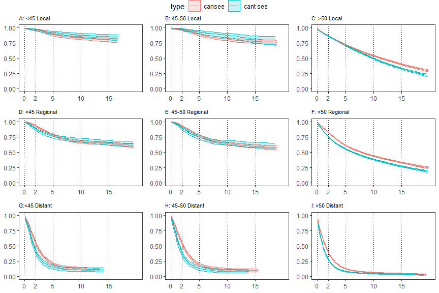<!-- -->

``` r
#?ggarrange()
#ggsave(plot=last_plot(),file="css_km.png",height=8, width=11.5)
```

<br><br>

## 8.2 OS plots

``` r
# Local
u45_local_plot_os <- make_plot_dat(new_data7, "under45", "Localized",FALSE)
a_os<-make_plot(u45_local_plot_os,"A: <45 Local")

midage_local_plot_os <- make_plot_dat(new_data7, "45-50", "Localized",FALSE)
b_os<-make_plot(midage_local_plot_os,"B: 45-49 Local")

o50_local_plot_os <- make_plot_dat(new_data7, "over50", "Localized",FALSE)
c_os<-make_plot(o50_local_plot_os ,"C: 50+ Local")


# Regional
u45_reg_plot_os <- make_plot_dat(new_data7, "under45", "Regional",FALSE)
d_os<-make_plot(u45_reg_plot_os,"D: <45 Regional")

midage_reg_plot_os <- make_plot_dat(new_data7, "45-50", "Regional",FALSE)
e_os<-make_plot(midage_reg_plot_os,"E: 45-49 Regional")

o50_reg_plot_os <- make_plot_dat(new_data7, "over50", "Regional",FALSE)
f_os<-make_plot(o50_reg_plot_os,"F: 50+ Regional")


# Distant
u45_dist_plot_os <- make_plot_dat(new_data7, "under45", "Distant",FALSE)
g_os<-make_plot(u45_dist_plot_os,"G:<45 Distant")

midage_dist_plot_os <- make_plot_dat(new_data7, "45-50", "Distant",FALSE)
h_os<-make_plot(midage_dist_plot_os ,"H: 45-49 Distant")

o50_dist_plot_os <- make_plot_dat(new_data7, "over50", "Distant",FALSE)
i_os<-make_plot(o50_dist_plot_os ,"I: 50+ Distant")

ggarrange(a_os,b_os,c_os,d_os,e_os,f_os,g_os,h_os,i_os,common.legend = TRUE, legend = "bottom")
```

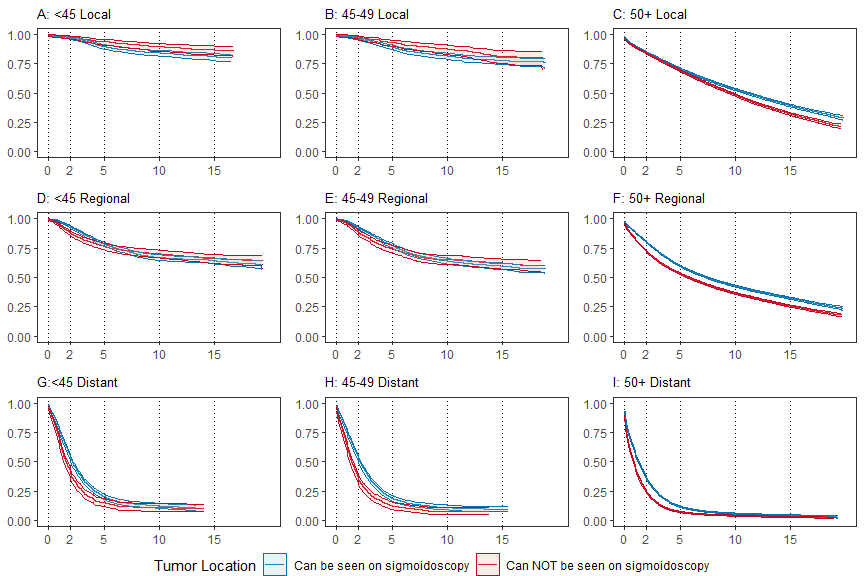<!-- -->

``` r
#ggsave(plot=last_plot(),file="os_km.png",height=8, width=11.5)
```

<br><br>

# 9 Session Info

``` r
sessionInfo()
```

    ## R version 4.2.2 (2022-10-31 ucrt)
    ## Platform: x86_64-w64-mingw32/x64 (64-bit)
    ## Running under: Windows 10 x64 (build 19044)
    ## 
    ## Matrix products: default
    ## 
    ## locale:
    ## [1] LC_COLLATE=English_United States.utf8 
    ## [2] LC_CTYPE=English_United States.utf8   
    ## [3] LC_MONETARY=English_United States.utf8
    ## [4] LC_NUMERIC=C                          
    ## [5] LC_TIME=English_United States.utf8    
    ## 
    ## attached base packages:
    ## [1] stats     graphics  grDevices utils     datasets  methods   base     
    ## 
    ## other attached packages:
    ##  [1] extrafont_0.19  table1_1.4.3    km.ci_0.5-6     survRM2_1.0-4  
    ##  [5] forcats_1.0.0   stringr_1.5.0   dplyr_1.1.0     purrr_1.0.1    
    ##  [9] readr_2.1.3     tidyr_1.3.0     tibble_3.1.8    tidyverse_1.3.2
    ## [13] survminer_0.4.9 ggpubr_0.5.0    ggplot2_3.4.0   survival_3.4-0 
    ## [17] MASS_7.3-58.1   broom_1.0.3    
    ## 
    ## loaded via a namespace (and not attached):
    ##  [1] fs_1.6.0            lubridate_1.9.1     bit64_4.0.5        
    ##  [4] httr_1.4.4          tools_4.2.2         backports_1.4.1    
    ##  [7] utf8_1.2.2          R6_2.5.1            DBI_1.1.3          
    ## [10] colorspace_2.1-0    withr_2.5.0         tidyselect_1.2.0   
    ## [13] gridExtra_2.3       bit_4.0.5           compiler_4.2.2     
    ## [16] extrafontdb_1.0     cli_3.4.1           rvest_1.0.3        
    ## [19] xml2_1.3.3          labeling_0.4.2      scales_1.2.1       
    ## [22] survMisc_0.5.6      digest_0.6.31       rmarkdown_2.20     
    ## [25] pkgconfig_2.0.3     htmltools_0.5.4     highr_0.10         
    ## [28] dbplyr_2.3.0        fastmap_1.1.0       rlang_1.0.6        
    ## [31] readxl_1.4.1        rstudioapi_0.14     farver_2.1.1       
    ## [34] generics_0.1.3      zoo_1.8-11          jsonlite_1.8.4     
    ## [37] vroom_1.6.1         car_3.1-1           googlesheets4_1.0.1
    ## [40] magrittr_2.0.3      Formula_1.2-5       Matrix_1.5-1       
    ## [43] munsell_0.5.0       fansi_1.0.3         abind_1.4-5        
    ## [46] lifecycle_1.0.3     stringi_1.7.12      yaml_2.3.7         
    ## [49] carData_3.0-5       grid_4.2.2          parallel_4.2.2     
    ## [52] crayon_1.5.2        lattice_0.20-45     cowplot_1.1.1      
    ## [55] haven_2.5.1         splines_4.2.2       hms_1.1.2          
    ## [58] knitr_1.42          pillar_1.8.1        ggsignif_0.6.4     
    ## [61] reprex_2.0.2        glue_1.6.2          evaluate_0.20      
    ## [64] data.table_1.14.6   modelr_0.1.10       vctrs_0.5.2        
    ## [67] tzdb_0.3.0          Rttf2pt1_1.3.12     cellranger_1.1.0   
    ## [70] gtable_0.3.1        assertthat_0.2.1    xfun_0.37          
    ## [73] xtable_1.8-4        rstatix_0.7.2       googledrive_2.0.0  
    ## [76] gargle_1.3.0        KMsurv_0.1-5        timechange_0.2.0   
    ## [79] ellipsis_0.3.2
