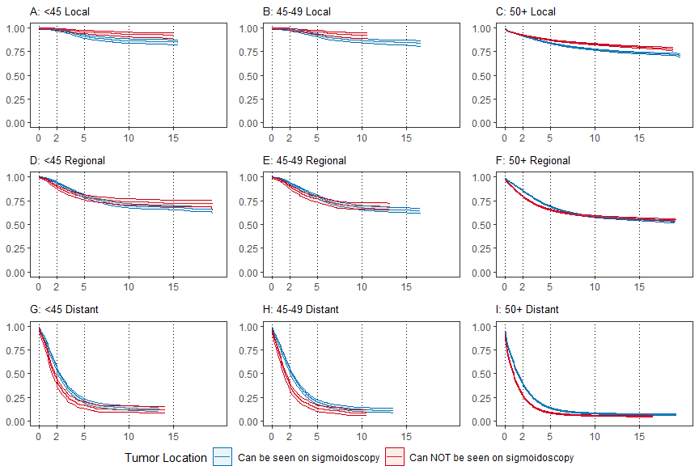

SEER Sigmoidoscopy Project
================
<david.hein@utsouthwestern.edu>
2023-02-20

- <a href="#1-load-packages-and-raw-data"
  id="toc-1-load-packages-and-raw-data">1 Load packages and raw data</a>
- <a href="#2-data-cleaning" id="toc-2-data-cleaning">2 Data cleaning</a>
- <a href="#3-setting-reference-groups"
  id="toc-3-setting-reference-groups">3 Setting reference groups</a>
- <a href="#4-logistic-regression" id="toc-4-logistic-regression">4
  Logistic Regression</a>
  - <a href="#41-logistic-results-sex" id="toc-41-logistic-results-sex">4.1
    Logistic results: sex</a>
  - <a href="#42-logistic-results-age" id="toc-42-logistic-results-age">4.2
    Logistic results: age</a>
  - <a href="#43-logistic-results-stage"
    id="toc-43-logistic-results-stage">4.3 Logistic results: stage</a>
  - <a href="#44-logistic-results-year"
    id="toc-44-logistic-results-year">4.4 Logistic results: year</a>
  - <a href="#45-logistic-results-race"
    id="toc-45-logistic-results-race">4.5 Logistic results: race</a>
  - <a href="#46-logistic-results-multivariate"
    id="toc-46-logistic-results-multivariate">4.6 Logistic results:
    multivariate</a>
- <a href="#5-survival-exploration-wcss"
  id="toc-5-survival-exploration-wcss">5 Survival exploration w/CSS</a>
  - <a href="#51-km-plots-can-see-on-sigmoidoscopy"
    id="toc-51-km-plots-can-see-on-sigmoidoscopy">5.1 KM plots: Can see on
    sigmoidoscopy</a>
  - <a href="#52-km-plots-stage" id="toc-52-km-plots-stage">5.2 KM plots:
    Stage</a>
  - <a href="#53-km-plots-year-of-diag"
    id="toc-53-km-plots-year-of-diag">5.3 KM plots: year of diag</a>
  - <a href="#54-km-plots-sex" id="toc-54-km-plots-sex">5.4 KM plots:
    sex</a>
  - <a href="#55-km-plots-age-group" id="toc-55-km-plots-age-group">5.5 KM
    plots: age group</a>
  - <a href="#56-km-plots-raceeth" id="toc-56-km-plots-raceeth">5.6 KM
    plots: race/eth</a>
  - <a href="#57-km-plots-site" id="toc-57-km-plots-site">5.7 KM plots:
    Site</a>
- <a href="#6-survival-analysis" id="toc-6-survival-analysis">6 Survival
  Analysis</a>
  - <a href="#61-css" id="toc-61-css">6.1 CSS</a>
    - <a href="#611-local" id="toc-611-local">6.1.1 Local</a>
    - <a href="#612-regional" id="toc-612-regional">6.1.2 Regional</a>
    - <a href="#613-distant" id="toc-613-distant">6.1.3 Distant</a>
  - <a href="#62-os" id="toc-62-os">6.2 OS</a>
    - <a href="#621-local" id="toc-621-local">6.2.1 Local</a>
    - <a href="#622-regional" id="toc-622-regional">6.2.2 Regional</a>
    - <a href="#623-distant" id="toc-623-distant">6.2.3 Distant</a>
- <a href="#7-km-plots-with-better-95-cis"
  id="toc-7-km-plots-with-better-95-cis">7 KM Plots with better 95%
  CIs</a>
- <a href="#8-css-plots" id="toc-8-css-plots">8 CSS Plots</a>
- <a href="#9-os-plots" id="toc-9-os-plots">9 OS plots</a>
- <a href="#10-session-info" id="toc-10-session-info">10 Session Info</a>

<br>

# 1 Load packages and raw data

``` r
library(broom)
library(MASS)
library(survival)
library(survminer)
library(tidyverse)
library(survRM2)
library(km.ci)
set.seed(2023)

seer_data <- read_delim("seer_data.txt", delim = "\t", escape_double = FALSE, trim_ws = TRUE)
```

<br>

# 2 Data cleaning

``` r
# Get only variables we want
new_data<-seer_data%>%dplyr::select(Sex, `Year of diagnosis`,
                                `Race and origin recode (NHW, NHB, NHAIAN, NHAPI, Hispanic)`,
                                `Primary Site`,`Grade (thru 2017)`,
                                `Grade Pathological (2018+)`,
                                `Combined Summary Stage (2004+)`,
                                `Summary stage 2000 (1998-2017)`,
                                `SEER cause-specific death classification`,
                                `Survival months`,
                                `Age recode with single ages and 100+`,
                                `Survival months flag`,
                                `Vital status recode (study cutoff used)`,
                                `Grade Clinical (2018+)`,
                                `Histologic Type ICD-O-3`)

# need to take out 181 appendix, 260, 188, and 189 becuase location unknown
new_data <-new_data %>% filter( !`Primary Site` %in% c(260,188,189,181))

# only adenocarcinoma
new_data <- new_data %>%filter(`Histologic Type ICD-O-3`==8140)

# make a new variable for site being seen on colonsocopy or sigmoid, should include 186 descending, 187 sigmoid, 199 rectosigmoid junction, 209 rectum NOS
new_data <- new_data %>% mutate(can_see_sigmoid = ifelse( `Primary Site` %in% c(186,187,199,209),1,0))

# make new variable for 3 age groups
new_data <- new_data %>% mutate(age_group = as.numeric(str_sub(`Age recode with single ages and 100+`,1,2)))
new_data <- new_data %>% mutate(age_group_final = ifelse(age_group <45,'under45', 'over50'))%>%
  mutate(age_group_final = ifelse(age_group <50 & age_group >= 45,'45-50',age_group_final))

# Combine the two stages
new_data<-new_data%>%mutate(new_stage = ifelse(`Summary stage 2000 (1998-2017)`=="Blank(s)",
                                               `Combined Summary Stage (2004+)`,`Summary stage 2000 (1998-2017)`))

# Filter out unknown stage an in situ
new_data2 <-new_data %>% filter( !new_stage %in%c("Unknown/unstaged","In situ"))

# Make nice grade variable
new_data2 <- new_data2 %>% mutate(final_grade = `Grade Pathological (2018+)`)
new_data2 <- new_data2 %>% mutate(final_grade = ifelse(`Grade (thru 2017)` %in% "Poorly differentiated; Grade III", "3", final_grade))
new_data2 <- new_data2 %>% mutate(final_grade = ifelse(`Grade (thru 2017)` %in% "Undifferentiated; anaplastic; Grade IV", "4", final_grade))
new_data2 <- new_data2 %>% mutate(final_grade = ifelse(`Grade (thru 2017)` %in% "Moderately differentiated; Grade II", "2", final_grade))
new_data2 <- new_data2 %>% mutate(final_grade = ifelse(`Grade (thru 2017)` %in% "Well differentiated; Grade I", "1", final_grade))

# toss em in an unknown/other
new_data2 <- new_data2 %>% mutate(final_grade = ifelse(final_grade%in%c("A", "B", "Blank(s)", "L","C", "H", "9","D"),"unk_other",final_grade))

# make smaller year of diagnosis groups
new_data2 <- new_data2 %>% mutate(year_of_diag = case_when(`Year of diagnosis`%in%c('2000', '2001', '2002' ,'2003' ,'2004') ~ "yod1",
                                                            `Year of diagnosis`%in%c('2005','2006', '2007', '2008' ,'2009') ~ "yod2",
                                                            `Year of diagnosis`%in%c('2010', '2011', '2012' ,'2013' ,'2014') ~ "yod3",
                                                            `Year of diagnosis`%in%c('2015', '2016', '2017' ,'2018' ,'2019') ~ "yod4"))

# make cleaner race/eth column name
new_data2<- new_data2%>%rename(race_eth=`Race and origin recode (NHW, NHB, NHAIAN, NHAPI, Hispanic)`)

# Survival
new_data3<-new_data2%>% mutate(cancer_specific_status = ifelse(`SEER cause-specific death classification`=="Dead (attributable to this cancer dx)",1,0 ))
new_data3<-new_data3%>% mutate(overall_status = ifelse(`Vital status recode (study cutoff used)`=="Alive",0,1 ))
new_data4<-new_data3%>%filter(`Survival months flag`=='Complete dates are available and there are more than 0 days of survival')

# Remove old data sets to save space
rm(seer_data)
rm(new_data)
rm(new_data2)
rm(new_data3)
```

<br>

# 3 Setting reference groups

Makes this easier for filling out tables and for regressions

``` r
# first select only variables we know we will be using to save space
new_data5<-new_data4 %>% dplyr::select(Sex,
                                       race_eth,
                                       can_see_sigmoid,
                                       age_group_final,
                                       new_stage, 
                                       final_grade,
                                       year_of_diag,
                                       cancer_specific_status, 
                                       overall_status,
                                       `Survival months`,
                                       `Primary Site`)%>%
                          rename(survival_months=`Survival months`, primary_site = `Primary Site`)

# set new factor levels, first level is the reference group
new_data5$new_stage <- factor(new_data5$new_stage, levels = c('Localized','Regional','Distant'))
new_data5$age_group_final <- factor(new_data5$age_group_final, levels = c('over50','under45','45-50'))
new_data5$year_of_diag <- factor(new_data5$year_of_diag, levels = c('yod1','yod2','yod3','yod4'))

# we dont need to specify all levels for race that would take too much typing, we just want to set the largest group as the reference
new_data5 <- within(new_data5, race_eth <- relevel(factor(race_eth), ref = 'Non-Hispanic White'))

# The grade variable appears to be unreliable
table(new_data5$final_grade,new_data5$year_of_diag)
```

    ##            
    ##              yod1  yod2  yod3  yod4
    ##   1          4588  4453  4322  6077
    ##   2         45855 47672 48094 50025
    ##   3         12570 12493 10672  9581
    ##   4           426   926  1746  1152
    ##   unk_other  3544  4425  5713 18235

``` r
# now using new_data5
rm(new_data4)

# Print out table 1
table(new_data5$primary_site,new_data5$age_group_final,new_data5$new_stage)
```

    ## , ,  = Localized
    ## 
    ##      
    ##       over50 under45 45-50
    ##   180  13198     389   372
    ##   182  13650     378   367
    ##   183   3115      99    82
    ##   184   5866     256   195
    ##   185   1812     113    81
    ##   186   3521     231   202
    ##   187  17389     987  1048
    ##   199   6519     414   416
    ##   209  18180    1305  1441
    ## 
    ## , ,  = Regional
    ## 
    ##      
    ##       over50 under45 45-50
    ##   180  18453     769   714
    ##   182  15959     778   610
    ##   183   4168     271   166
    ##   184   7985     510   397
    ##   185   3233     264   202
    ##   186   5212     531   405
    ##   187  23032    2213  2041
    ##   199   9707    1012   956
    ##   209  22956    2819  2539
    ## 
    ## , ,  = Distant
    ## 
    ##      
    ##       over50 under45 45-50
    ##   180  10628     507   579
    ##   182   7312     405   421
    ##   183   2149     173   138
    ##   184   3715     321   238
    ##   185   1579     152   138
    ##   186   2641     343   286
    ##   187  14875    1799  1551
    ##   199   6377     736   666
    ##   209  12285    1575  1452

<br>

# 4 Logistic Regression

Calculates odds of tumor in location seen on sigmoidoscopy, first
univariate then multivariate

``` r
# Code below calculates, exps, and does CI, then only saves the output to save space

sex_log<-tidy(glm(can_see_sigmoid~Sex,data=new_data5,family="binomial"),conf.int=TRUE)%>%
          mutate(estimate=exp(estimate), conf.low=exp(conf.low), conf.high=exp(conf.high))

age_log<-tidy(glm(can_see_sigmoid~age_group_final,data=new_data5,family="binomial"),conf.int=TRUE)%>%
          mutate(estimate=exp(estimate), conf.low=exp(conf.low), conf.high=exp(conf.high))

stage_log<-tidy(glm(can_see_sigmoid~new_stage,data=new_data5,family="binomial"),conf.int=TRUE)%>%
            mutate(estimate=exp(estimate), conf.low=exp(conf.low), conf.high=exp(conf.high))

year_log<-tidy(glm(can_see_sigmoid~year_of_diag,data=new_data5,family="binomial"),conf.int=TRUE)%>%
            mutate(estimate=exp(estimate), conf.low=exp(conf.low), conf.high=exp(conf.high))

race_log<-tidy(glm(can_see_sigmoid~race_eth,data=new_data5,family="binomial"),conf.int=TRUE)%>%
            mutate(estimate=exp(estimate), conf.low=exp(conf.low), conf.high=exp(conf.high))

# Multivariate, Check out interactions
multi_log<-tidy(glm(can_see_sigmoid~race_eth+Sex+age_group_final+new_stage+year_of_diag,data=new_data5,family="binomial"),conf.int=TRUE)%>%
  mutate(estimate=exp(estimate),conf.low=exp(conf.low),conf.high=exp(conf.high))
```

<br>

## 4.1 Logistic results: sex

``` r
knitr::kable(sex_log,digits=2)
```

| term        | estimate | std.error | statistic | p.value | conf.low | conf.high |
|:------------|---------:|----------:|----------:|--------:|---------:|----------:|
| (Intercept) |     1.11 |      0.01 |     19.11 |       0 |     1.10 |      1.12 |
| SexMale     |     1.54 |      0.01 |     57.05 |       0 |     1.51 |      1.56 |

## 4.2 Logistic results: age

``` r
knitr::kable(age_log,digits=2)
```

| term                   | estimate | std.error | statistic | p.value | conf.low | conf.high |
|:-----------------------|---------:|----------:|----------:|--------:|---------:|----------:|
| (Intercept)            |     1.26 |      0.00 |     58.96 |       0 |     1.25 |      1.27 |
| age_group_finalunder45 |     2.05 |      0.02 |     43.44 |       0 |     1.99 |      2.12 |
| age_group_final45-50   |     2.19 |      0.02 |     44.78 |       0 |     2.11 |      2.26 |

## 4.3 Logistic results: stage

``` r
knitr::kable(stage_log,digits=2)
```

| term              | estimate | std.error | statistic | p.value | conf.low | conf.high |
|:------------------|---------:|----------:|----------:|--------:|---------:|----------:|
| (Intercept)       |     1.29 |      0.01 |     38.48 |       0 |     1.28 |      1.31 |
| new_stageRegional |     1.04 |      0.01 |      4.82 |       0 |     1.03 |      1.06 |
| new_stageDistant  |     1.21 |      0.01 |     19.09 |       0 |     1.19 |      1.24 |

## 4.4 Logistic results: year

``` r
knitr::kable(year_log,digits=2)
```

| term             | estimate | std.error | statistic | p.value | conf.low | conf.high |
|:-----------------|---------:|----------:|----------:|--------:|---------:|----------:|
| (Intercept)      |     1.34 |      0.01 |     37.34 |    0.00 |     1.32 |      1.36 |
| year_of_diagyod2 |     1.00 |      0.01 |      0.03 |    0.98 |     0.98 |      1.02 |
| year_of_diagyod3 |     1.03 |      0.01 |      2.72 |    0.01 |     1.01 |      1.05 |
| year_of_diagyod4 |     1.08 |      0.01 |      7.77 |    0.00 |     1.06 |      1.11 |

## 4.5 Logistic results: race

``` r
knitr::kable(race_log,digits=2)
```

| term                                               | estimate | std.error | statistic | p.value | conf.low | conf.high |
|:---------------------------------------------------|---------:|----------:|----------:|--------:|---------:|----------:|
| (Intercept)                                        |     1.32 |      0.00 |     60.89 |       0 |     1.31 |      1.33 |
| race_ethHispanic (All Races)                       |     1.27 |      0.01 |     19.68 |       0 |     1.24 |      1.30 |
| race_ethNon-Hispanic American Indian/Alaska Native |     1.23 |      0.04 |      4.64 |       0 |     1.13 |      1.34 |
| race_ethNon-Hispanic Asian or Pacific Islander     |     1.60 |      0.01 |     33.45 |       0 |     1.55 |      1.64 |
| race_ethNon-Hispanic Black                         |     0.80 |      0.01 |    -18.41 |       0 |     0.78 |      0.82 |
| race_ethNon-Hispanic Unknown Race                  |     1.39 |      0.07 |      4.82 |       0 |     1.22 |      1.59 |

## 4.6 Logistic results: multivariate

``` r
knitr::kable(multi_log,digits=2)
```

| term                                               | estimate | std.error | statistic | p.value | conf.low | conf.high |
|:---------------------------------------------------|---------:|----------:|----------:|--------:|---------:|----------:|
| (Intercept)                                        |     0.96 |      0.01 |     -4.28 |    0.00 |     0.94 |      0.98 |
| race_ethHispanic (All Races)                       |     1.18 |      0.01 |     13.57 |    0.00 |     1.15 |      1.21 |
| race_ethNon-Hispanic American Indian/Alaska Native |     1.17 |      0.04 |      3.58 |    0.00 |     1.08 |      1.28 |
| race_ethNon-Hispanic Asian or Pacific Islander     |     1.56 |      0.01 |     31.50 |    0.00 |     1.52 |      1.61 |
| race_ethNon-Hispanic Black                         |     0.77 |      0.01 |    -21.27 |    0.00 |     0.75 |      0.79 |
| race_ethNon-Hispanic Unknown Race                  |     1.34 |      0.07 |      4.30 |    0.00 |     1.18 |      1.54 |
| SexMale                                            |     1.52 |      0.01 |     55.26 |    0.00 |     1.50 |      1.55 |
| age_group_finalunder45                             |     2.01 |      0.02 |     41.81 |    0.00 |     1.95 |      2.08 |
| age_group_final45-50                               |     2.15 |      0.02 |     43.25 |    0.00 |     2.07 |      2.22 |
| new_stageRegional                                  |     1.01 |      0.01 |      0.75 |    0.45 |     0.99 |      1.02 |
| new_stageDistant                                   |     1.16 |      0.01 |     14.50 |    0.00 |     1.14 |      1.18 |
| year_of_diagyod2                                   |     0.98 |      0.01 |     -2.06 |    0.04 |     0.96 |      1.00 |
| year_of_diagyod3                                   |     0.99 |      0.01 |     -1.31 |    0.19 |     0.96 |      1.01 |
| year_of_diagyod4                                   |     1.02 |      0.01 |      2.01 |    0.04 |     1.00 |      1.04 |

<br>

# 5 Survival exploration w/CSS

Makes KM curves using CSS, checks proportional hazards assumptions

## 5.1 KM plots: Can see on sigmoidoscopy

``` r
# CAN SEE
km_cansee<-survfit(Surv(survival_months, cancer_specific_status) ~ can_see_sigmoid, data = new_data5)
plot(km_cansee,fun="cloglog")
ggsurvplot(km_cansee,censor=FALSE) # BIGGEST TIME DEPENDANT!!!
```

<!-- --><!-- -->

## 5.2 KM plots: Stage

``` r
# STAGE
km_new_stage<-survfit(Surv(survival_months, cancer_specific_status) ~new_stage, data = new_data5)
plot(km_new_stage,fun="cloglog")
```

<!-- -->

## 5.3 KM plots: year of diag

``` r
# YEAR OF DIAG
km_year_of_diag<-survfit(Surv(survival_months, cancer_specific_status) ~ year_of_diag, data = new_data5)
ggsurvplot(km_year_of_diag,censor=FALSE)
```

<!-- -->

``` r
plot(km_year_of_diag,fun="cloglog")
```

<!-- -->

## 5.4 KM plots: sex

``` r
# SEX
km_Sex<-survfit(Surv(survival_months, cancer_specific_status) ~ Sex, data = new_data5)
ggsurvplot(km_Sex,censor=FALSE)
```

<!-- -->

``` r
plot(km_Sex,fun="cloglog") # lines cross but tiny
```

<!-- -->

## 5.5 KM plots: age group

``` r
# AGE GROUP
km_age_group_final<-survfit(Surv(survival_months, cancer_specific_status) ~ age_group_final, data = new_data5)
ggsurvplot(km_age_group_final,censor=FALSE) # lines cross but tiny
```

<!-- -->

``` r
plot(km_age_group_final,fun="cloglog") 
```

<!-- -->

## 5.6 KM plots: race/eth

``` r
# RACE ETH
km_race_eth<-survfit(Surv(survival_months, cancer_specific_status) ~ race_eth, data = new_data5)
ggsurvplot(km_race_eth,censor=FALSE) # lines cross but insignificant 
```

<!-- -->

``` r
plot(km_race_eth,fun="cloglog") 
```

<!-- -->

## 5.7 KM plots: Site

``` r
# SITE (this is just can see sigmoid with more definition)
km_site<-survfit(Surv(survival_months, cancer_specific_status) ~ primary_site, data = new_data5)
ggsurvplot(km_site,censor=FALSE,ylim=c(0.5,1),xlim=c(0,100))
```

    ## Warning: Removed 320 rows containing missing values (`geom_step()`).
    ## Removed 320 rows containing missing values (`geom_step()`).

<!-- -->

``` r
#table(new_data5$primary_site)
```

<br>

# 6 Survival Analysis

``` r
# take out patients with 0 survival months
new_data6<-new_data5%>%filter(survival_months>0)
new_data7<- new_data6%>%select(survival_months,cancer_specific_status,can_see_sigmoid,age_group_final,new_stage,overall_status)

# computes rmst with age group as a covariate, takes dataframe, vector of time points, and the stage as inputs, returns a data frame with results across time points in columns, rows are the stats we are looking at (add option to switch to OS)
compute_rmst_with_age <- function(data,time_points,stage,css=TRUE){
  
  data<-new_data7
  stage="Localized"
  data<-data %>% filter(new_stage==stage)
  covs<-model.matrix(~age_group_final*can_see_sigmoid,data=data)
  
  
  rms_combined <- data.frame(col1="rmst")
  
  for (t in time_points){
    # calcs rmst with alpha corrected for 3 stages and number of time points 
    if (css) {
       rms_temp <- rmst2(time=data$survival_months,status=data$cancer_specific_status,arm=data$can_see_sigmoid,covariates=covs,tau=t,alpha=0.05/(3*length(time_points)) )
    }else{
       rms_temp <- rmst2(time=data$survival_months,status=data$overall_status,arm=data$can_see_sigmoid,covariates=covs,tau=t,alpha=0.05/(3*length(time_points)) )
    }
   
    # round and add results to the data frame, each time point will be added as a block of columns 
    rms_temp_res <- data.frame(rms_temp$RMST.difference.adjusted) %>% select(-se.coef., -z ) %>% mutate_all((function(x) round(x,digits=3))) %>% setNames( paste0('m_',t,"_",names(.)) )
    rms_combined <- cbind(rms_combined,rms_temp_res)
  }
  
  return(rms_combined)
}

# Compute RMST individually
compute_rmst_individually <- function(data,time_points,stage,css=TRUE){
  
  data<-data %>% filter(new_stage==stage)
  
  u45<-data%>%filter(age_group_final=="under45")
  mid<-data%>%filter(age_group_final=="45-50")
  o50<-data%>%filter(age_group_final=="over50")
  data_list <- list(u45,mid,o50)
  
  rms_combined_res = list()
  agegroup = c("u45","mid","o50")
  i=1
  for (age_data in data_list){
    
    rms_combined <- data.frame(col1="rmst")
    
    for (t in time_points){
      # calcs rmst with alpha corrected for 3 stages and number of time points 
      if (css) {
         rms_temp <- rmst2(time=age_data$survival_months,status=age_data$cancer_specific_status,arm=age_data$can_see_sigmoid,tau=t,alpha=0.05/(3*3*length(time_points)) )
      }else{
         rms_temp <- rmst2(time=age_data$survival_months,status=age_data$overall_status,arm=age_data$can_see_sigmoid,tau=t,alpha=0.05/(3*length(time_points)) )
      }
      
      
      # round and add results to the data frame, each time point will be added as a block of columns 
      rms_temp_res <- data.frame(rms_temp$unadjusted.result)[1,] %>% mutate_all((function(x) round(x,digits=3))) #%>% setNames( paste0('m_',t,"_",names(.)) )
      colnames(rms_temp_res) <- c(paste0("Diff ",t),paste0("Low CI ",t), paste0("Up CI ",t), paste0("p val ",t))
      rms_combined <- cbind(rms_combined,rms_temp_res)
    }
    
  rms_combined_res[[paste0(agegroup[i])]] <- rms_combined
  i=i+1
  }
  rms_combined_res_final <- do.call(rbind,rms_combined_res)
  return(rms_combined_res_final)
}

local_res_combined_css <- compute_rmst_individually(new_data7,c(12,24,60,120),"Localized")
regional_res_combined_css <- compute_rmst_individually(new_data7,c(12,24,60,120),"Regional")
distant_res_combined_css <- compute_rmst_individually(new_data7,c(12,24,60,120),"Distant")

local_res_combined_os <- compute_rmst_individually(new_data7,c(12,24,60,120),"Localized",FALSE)
regional_res_combined_os <- compute_rmst_individually(new_data7,c(12,24,60,120),"Regional",FALSE)
distant_res_combined_os <- compute_rmst_individually(new_data7,c(12,24,60,120),"Distant",FALSE)
```

<br>

## 6.1 CSS

### 6.1.1 Local

``` r
knitr::kable(local_res_combined_css,digits=3)
```

|     | col1 | Diff 12 | Low CI 12 | Up CI 12 | p val 12 | Diff 24 | Low CI 24 | Up CI 24 | p val 24 | Diff 60 | Low CI 60 | Up CI 60 | p val 60 | Diff 120 | Low CI 120 | Up CI 120 | p val 120 |
|-----|:-----|--------:|----------:|----------|---------:|--------:|----------:|----------|---------:|--------:|----------:|----------|----------|----------|-----------:|----------:|-----------|
| u45 | rmst |  -0.024 |    -0.095 | 0.048    |    0.287 |  -0.120 |    -0.308 | 0.069    |    0.042 |  -1.120 |    -1.959 | -0.282   | 0        | -5.057   |     -7.659 |    -2.455 | 0         |
| mid | rmst |  -0.057 |    -0.110 | -0.003   |    0.001 |  -0.171 |    -0.324 | -0.018   |    0.000 |  -0.890 |    -1.697 | -0.082   | 0        | -3.924   |     -6.566 |    -1.283 | 0         |
| o50 | rmst |  -0.015 |    -0.051 | 0.021    |    0.178 |  -0.096 |    -0.188 | -0.005   |    0.001 |  -0.974 |    -1.296 | -0.653   | 0        | -4.056   |     -4.899 |    -3.213 | 0         |

### 6.1.2 Regional

``` r
knitr::kable(regional_res_combined_css,digits=3)
```

|     | col1 | Diff 12 | Low CI 12 | Up CI 12 | p val 12 | Diff 24 | Low CI 24 | Up CI 24 | p val 24 | Diff 60 | Low CI 60 | Up CI 60 | p val 60 | Diff 120 | Low CI 120 | Up CI 120 | p val 120 |
|-----|:-----|---------|----------:|---------:|----------|---------|----------:|---------:|----------|---------|----------:|---------:|----------|---------:|-----------:|----------:|----------:|
| u45 | rmst | 0.115   |     0.032 |    0.199 | 0        | 0.527   |     0.257 |    0.797 | 0        | 1.683   |     0.508 |    2.858 | 0        |    0.458 |     -2.710 |     3.626 |     0.644 |
| mid | rmst | 0.099   |     0.008 |    0.189 | 0        | 0.421   |     0.137 |    0.705 | 0        | 1.793   |     0.514 |    3.072 | 0        |    1.914 |     -1.611 |     5.440 |     0.083 |
| o50 | rmst | 0.225   |     0.185 |    0.266 | 0        | 0.777   |     0.668 |    0.886 | 0        | 2.431   |     2.040 |    2.822 | 0        |    2.710 |      1.728 |     3.692 |     0.000 |

### 6.1.3 Distant

``` r
knitr::kable(distant_res_combined_css,digits=3)
```

|     | col1 | Diff 12 | Low CI 12 | Up CI 12 | p val 12 | Diff 24 | Low CI 24 | Up CI 24 | p val 24 | Diff 60 | Low CI 60 | Up CI 60 | p val 60 | Diff 120 | Low CI 120 | Up CI 120 | p val 120 |
|-----|:-----|---------|----------:|---------:|----------|---------|----------:|---------:|----------|---------|----------:|---------:|----------|---------:|-----------:|----------:|-----------|
| u45 | rmst | 0.593   |     0.290 |    0.896 | 0        | 2.105   |     1.345 |    2.865 | 0        | 5.518   |     3.472 |    7.564 | 0        |    7.320 |      3.235 |    11.405 | 0         |
| mid | rmst | 0.826   |     0.486 |    1.165 | 0        | 2.678   |     1.862 |    3.495 | 0        | 6.705   |     4.631 |    8.780 | 0        |    9.283 |      5.361 |    13.205 | 0         |
| o50 | rmst | 0.909   |     0.795 |    1.024 | 0        | 2.404   |     2.152 |    2.655 | 0        | 5.451   |     4.883 |    6.018 | 0        |    7.350 |      6.346 |     8.353 | 0         |

<br>

## 6.2 OS

### 6.2.1 Local

``` r
knitr::kable(local_res_combined_os,digits=3)
```

|     | col1 | Diff 12 | Low CI 12 | Up CI 12 | p val 12 | Diff 24 | Low CI 24 | Up CI 24 | p val 24 | Diff 60 | Low CI 60 | Up CI 60 | p val 60 | Diff 120 | Low CI 120 | Up CI 120 | p val 120 |
|-----|:-----|--------:|----------:|----------|---------:|--------:|----------:|----------|---------:|--------:|----------:|----------|---------:|----------|-----------:|----------:|----------:|
| u45 | rmst |   0.014 |    -0.075 | 0.103    |    0.658 |   0.015 |    -0.228 | 0.258    |    0.860 |  -0.508 |    -1.492 | 0.476    |    0.139 | -3.150   |     -5.997 |    -0.303 |     0.002 |
| mid | rmst |  -0.071 |    -0.141 | -0.001   |    0.004 |  -0.244 |    -0.438 | -0.051   |    0.000 |  -1.175 |    -2.081 | -0.270   |    0.000 | -4.563   |     -7.383 |    -1.742 |     0.000 |
| o50 | rmst |   0.048 |     0.003 | 0.092    |    0.002 |   0.119 |     0.007 | 0.231    |    0.002 |   0.354 |    -0.024 | 0.733    |    0.007 | 1.944    |      1.011 |     2.878 |     0.000 |

### 6.2.2 Regional

``` r
knitr::kable(regional_res_combined_os,digits=3)
```

|     | col1 | Diff 12 | Low CI 12 | Up CI 12 | p val 12 | Diff 24 | Low CI 24 | Up CI 24 | p val 24 | Diff 60 | Low CI 60 | Up CI 60 | p val 60 | Diff 120 | Low CI 120 | Up CI 120 | p val 120 |
|-----|:-----|---------|----------:|---------:|---------:|---------|----------:|---------:|----------|---------|----------:|---------:|----------|---------:|-----------:|----------:|----------:|
| u45 | rmst | 0.191   |     0.100 |    0.282 |    0.000 | 0.724   |     0.449 |    0.999 | 0        | 2.252   |     1.136 |    3.369 | 0        |    1.831 |     -1.107 |     4.769 |     0.074 |
| mid | rmst | 0.090   |     0.005 |    0.176 |    0.002 | 0.417   |     0.150 |    0.684 | 0        | 1.761   |     0.578 |    2.944 | 0        |    2.151 |     -1.074 |     5.376 |     0.056 |
| o50 | rmst | 0.315   |     0.272 |    0.359 |    0.000 | 1.027   |     0.914 |    1.140 | 0        | 3.499   |     3.123 |    3.875 | 0        |    6.857 |      5.985 |     7.728 |     0.000 |

### 6.2.3 Distant

``` r
knitr::kable(distant_res_combined_os,digits=3)
```

|     | col1 | Diff 12 | Low CI 12 | Up CI 12 | p val 12 | Diff 24 | Low CI 24 | Up CI 24 | p val 24 | Diff 60 | Low CI 60 | Up CI 60 | p val 60 | Diff 120 | Low CI 120 | Up CI 120 | p val 120 |
|-----|:-----|---------|----------:|---------:|----------|---------|----------:|---------:|----------|---------|----------:|---------:|----------|---------:|-----------:|----------:|-----------|
| u45 | rmst | 0.604   |     0.328 |    0.881 | 0        | 2.127   |     1.442 |    2.811 | 0        | 5.672   |     3.887 |    7.457 | 0        |    7.490 |      4.017 |    10.963 | 0         |
| mid | rmst | 0.823   |     0.517 |    1.130 | 0        | 2.693   |     1.962 |    3.425 | 0        | 6.735   |     4.919 |    8.552 | 0        |    9.219 |      5.880 |    12.559 | 0         |
| o50 | rmst | 0.922   |     0.817 |    1.026 | 0        | 2.381   |     2.158 |    2.604 | 0        | 5.221   |     4.738 |    5.703 | 0        |    6.848 |      6.047 |     7.648 | 0         |

<br><br>

# 7 KM Plots with better 95% CIs

``` r
# makes a KM fit and calcs logep 95% CIs, returns the data for use with ggplot. Takes full dataset, age group and stage as strings, TRUE for CSS and FALSE for OS
make_plot_dat <- function(data_set, age_grp, stage, css = TRUE){
  
  # make a can and no can see set
  can <- data_set%>%filter(age_group_final==age_grp,new_stage==stage,can_see_sigmoid==1)
  nocan <- data_set%>%filter(age_group_final==age_grp,new_stage==stage,can_see_sigmoid==0)
  
  # fit to css or os
  if (css){
    fit1 <- surv_fit(Surv(survival_months,cancer_specific_status)~1,data=can)
    fit2 <-  surv_fit(Surv(survival_months,cancer_specific_status)~1,data=nocan)
  }else{
    fit1 <- surv_fit(Surv(survival_months,overall_status)~1,data=can)
    fit2 <- surv_fit(Surv(survival_months,overall_status)~1,data=nocan)
  }
  
  # compute the logep CIs (more appropriate for comparing across the whole curve)
  fit1 <- km.ci(fit1,conf.level = 0.95,method = "logep")
  fit2 <- km.ci(fit2,conf.level = 0.95,method = "logep")
  
  # extract and return data needed to generate plots
  pltdat1 <- as.data.frame(cbind(fit1$surv,fit1$time,fit1$n.risk,fit1$n.event,fit1$lower,fit1$upper))%>%mutate(type="cansee")
  pltdat2 <- as.data.frame(cbind(fit2$surv,fit2$time,fit2$n.risk,fit2$n.event,fit2$lower,fit2$upper))%>%mutate(type="cant see")
  
  colnames(pltdat1)<-c("surv","time","nrisk","nevent","lower","upper","type")
  colnames(pltdat2)<-c("surv","time","nrisk","nevent","lower","upper","type")

  plt3 <- rbind(pltdat1,pltdat2)
  return(plt3)
}

make_plot <- function(plot_dat,fig_title){# takes in plot data generated from make_plot_dat plus a string as the fig title, returns ggplot object of KM plot
  
  p <- ggplot(plot_dat ,aes(x=time,y=surv,color=type))+
    geom_step()+
    # set custom y axis limits, might actually want to just have the at 0,1 for all graphs 
    ylim(if(str_detect(fig_title,"Distant")) c(0,1) else c(0,1))+
    geom_ribbon(aes(ymin=lower,ymax=upper,x=time,fill=type),alpha=.2,size=0.1)+
    ggtitle(fig_title)+theme_test()+
    theme(
      plot.title = element_text(size=8),
      axis.title = element_blank(),
      panel.grid.major.x= element_line(linewidth=0.2,linetype = 3))+
    # x axis breaks at 2,5,10, and 15 years
    scale_x_continuous(limits=c(0,240),breaks=c(0,24,60,120,180),labels=c("0","2","5","10","15"))
    
  return(p)
}
```

<br><br>

# 8 CSS Plots

``` r
# Local
u45_local_plot <- make_plot_dat(new_data7, "under45", "Localized")
a<-make_plot(u45_local_plot,"A: <45 Local")
```

    ## Warning: Using `size` aesthetic for lines was deprecated in ggplot2 3.4.0.
    ## ℹ Please use `linewidth` instead.

``` r
midage_local_plot <- make_plot_dat(new_data7, "45-50", "Localized")
b<-make_plot(midage_local_plot,"B: 45-50 Local")

o50_local_plot <- make_plot_dat(new_data7, "over50", "Localized")
c<-make_plot(o50_local_plot ,"C: >50 Local")


# Regional
u45_reg_plot <- make_plot_dat(new_data7, "under45", "Regional")
d<-make_plot(u45_reg_plot,"D: <45 Regional")

midage_reg_plot <- make_plot_dat(new_data7, "45-50", "Regional")
e<-make_plot(midage_reg_plot,"E: 45-50 Regional")

o50_reg_plot <- make_plot_dat(new_data7, "over50", "Regional")
f<-make_plot(o50_reg_plot,"F: >50 Regional")


# Distant
u45_dist_plot <- make_plot_dat(new_data7, "under45", "Distant")
g<-make_plot(u45_dist_plot,"G:<45 Distant")

midage_dist_plot <- make_plot_dat(new_data7, "45-50", "Distant")
h<-make_plot(midage_dist_plot ,"H: 45-50 Distant")

o50_dist_plot <- make_plot_dat(new_data7, "over50", "Distant")
i<-make_plot(o50_dist_plot ,"I: >50 Distant")

ggarrange(a,b,c,d,e,f,g,h,i,common.legend = TRUE)
```

<!-- -->

``` r
ggsave(plot=last_plot(),file="css_km.png",height=8, width=11.5)
```

<br><br>

# 9 OS plots

``` r
# Local
u45_local_plot <- make_plot_dat(new_data7, "under45", "Localized",FALSE)
a<-make_plot(u45_local_plot,"A: <45 Local")

midage_local_plot <- make_plot_dat(new_data7, "45-50", "Localized",FALSE)
b<-make_plot(midage_local_plot,"B: 45-50 Local")

o50_local_plot <- make_plot_dat(new_data7, "over50", "Localized",FALSE)
c<-make_plot(o50_local_plot ,"C: >50 Local")


# Regional
u45_reg_plot <- make_plot_dat(new_data7, "under45", "Regional",FALSE)
d<-make_plot(u45_reg_plot,"D: <45 Regional")

midage_reg_plot <- make_plot_dat(new_data7, "45-50", "Regional",FALSE)
e<-make_plot(midage_reg_plot,"E: 45-50 Regional")

o50_reg_plot <- make_plot_dat(new_data7, "over50", "Regional",FALSE)
f<-make_plot(o50_reg_plot,"F: >50 Regional")


# Distant
u45_dist_plot <- make_plot_dat(new_data7, "under45", "Distant",FALSE)
g<-make_plot(u45_dist_plot,"G:<45 Distant")

midage_dist_plot <- make_plot_dat(new_data7, "45-50", "Distant",FALSE)
h<-make_plot(midage_dist_plot ,"H: 45-50 Distant")

o50_dist_plot <- make_plot_dat(new_data7, "over50", "Distant",FALSE)
i<-make_plot(o50_dist_plot ,"I: >50 Distant")

ggarrange(a,b,c,d,e,f,g,h,i,common.legend = TRUE)+ggtitle("OS")
```

<!-- -->

``` r
#ggsave(plot=last_plot(),file="os_km.png",height=8, width=11.5)
```

<br><br>

# 10 Session Info

``` r
sessionInfo()
```

    ## R version 4.2.2 (2022-10-31 ucrt)
    ## Platform: x86_64-w64-mingw32/x64 (64-bit)
    ## Running under: Windows 10 x64 (build 19044)
    ## 
    ## Matrix products: default
    ## 
    ## locale:
    ## [1] LC_COLLATE=English_United States.utf8 
    ## [2] LC_CTYPE=English_United States.utf8   
    ## [3] LC_MONETARY=English_United States.utf8
    ## [4] LC_NUMERIC=C                          
    ## [5] LC_TIME=English_United States.utf8    
    ## 
    ## attached base packages:
    ## [1] stats     graphics  grDevices utils     datasets  methods   base     
    ## 
    ## other attached packages:
    ##  [1] km.ci_0.5-6     survRM2_1.0-4   forcats_1.0.0   stringr_1.5.0  
    ##  [5] dplyr_1.1.0     purrr_1.0.1     readr_2.1.3     tidyr_1.3.0    
    ##  [9] tibble_3.1.8    tidyverse_1.3.2 survminer_0.4.9 ggpubr_0.5.0   
    ## [13] ggplot2_3.4.0   survival_3.4-0  MASS_7.3-58.1   broom_1.0.3    
    ## 
    ## loaded via a namespace (and not attached):
    ##  [1] fs_1.6.0            lubridate_1.9.1     bit64_4.0.5        
    ##  [4] httr_1.4.4          tools_4.2.2         backports_1.4.1    
    ##  [7] utf8_1.2.2          R6_2.5.1            DBI_1.1.3          
    ## [10] colorspace_2.1-0    withr_2.5.0         tidyselect_1.2.0   
    ## [13] gridExtra_2.3       bit_4.0.5           compiler_4.2.2     
    ## [16] textshaping_0.3.6   cli_3.4.1           rvest_1.0.3        
    ## [19] xml2_1.3.3          labeling_0.4.2      scales_1.2.1       
    ## [22] survMisc_0.5.6      systemfonts_1.0.4   digest_0.6.31      
    ## [25] rmarkdown_2.20      pkgconfig_2.0.3     htmltools_0.5.4    
    ## [28] dbplyr_2.3.0        fastmap_1.1.0       highr_0.10         
    ## [31] rlang_1.0.6         readxl_1.4.1        rstudioapi_0.14    
    ## [34] generics_0.1.3      farver_2.1.1        zoo_1.8-11         
    ## [37] jsonlite_1.8.4      vroom_1.6.1         car_3.1-1          
    ## [40] googlesheets4_1.0.1 magrittr_2.0.3      Matrix_1.5-1       
    ## [43] munsell_0.5.0       fansi_1.0.3         abind_1.4-5        
    ## [46] lifecycle_1.0.3     stringi_1.7.12      yaml_2.3.7         
    ## [49] carData_3.0-5       grid_4.2.2          parallel_4.2.2     
    ## [52] crayon_1.5.2        lattice_0.20-45     haven_2.5.1        
    ## [55] cowplot_1.1.1       splines_4.2.2       hms_1.1.2          
    ## [58] knitr_1.42          pillar_1.8.1        ggsignif_0.6.4     
    ## [61] reprex_2.0.2        glue_1.6.2          evaluate_0.20      
    ## [64] data.table_1.14.6   modelr_0.1.10       vctrs_0.5.2        
    ## [67] tzdb_0.3.0          cellranger_1.1.0    gtable_0.3.1       
    ## [70] assertthat_0.2.1    xfun_0.37           xtable_1.8-4       
    ## [73] rstatix_0.7.2       ragg_1.2.5          googledrive_2.0.0  
    ## [76] gargle_1.3.0        KMsurv_0.1-5        timechange_0.2.0   
    ## [79] ellipsis_0.3.2
